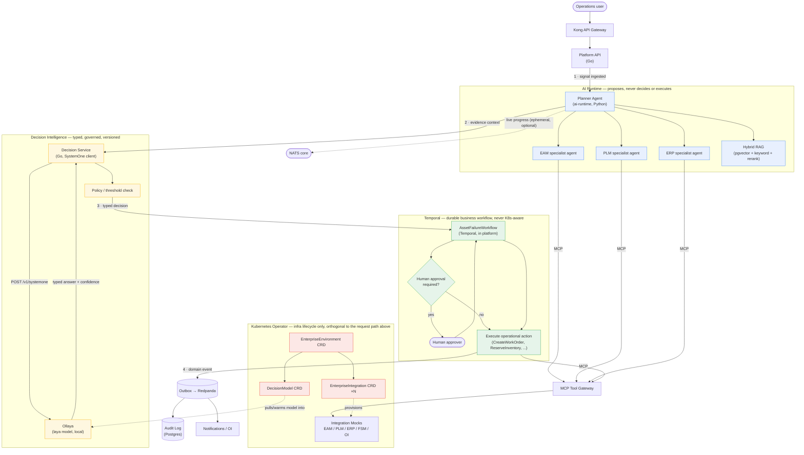
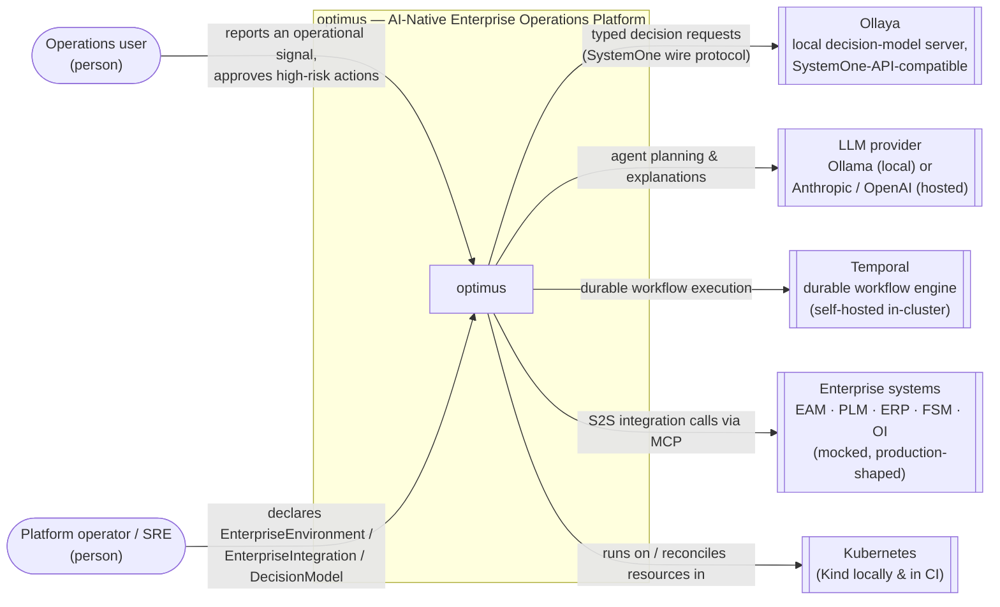
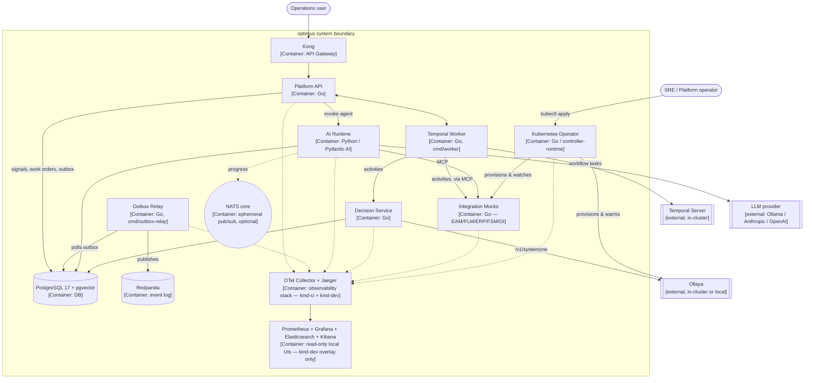
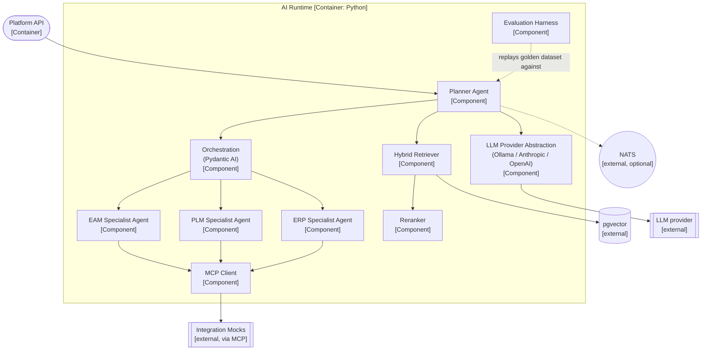
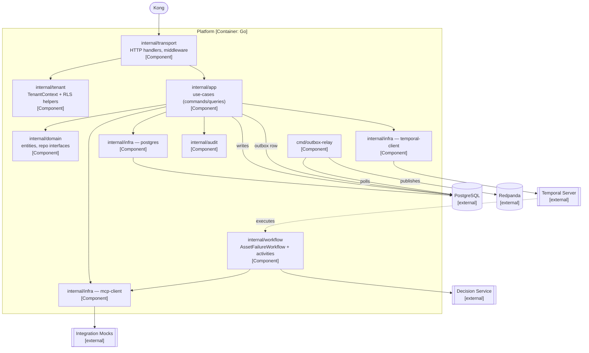
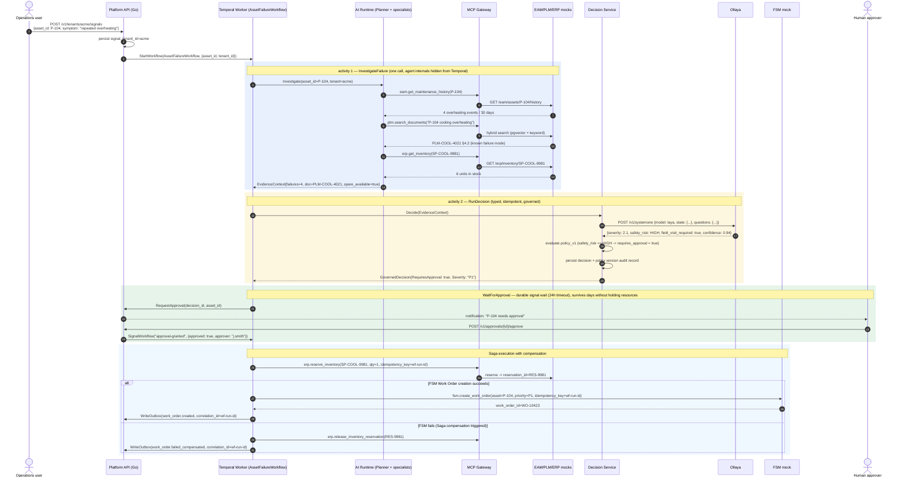

# PRD — `optimus`: AI-Native Enterprise Operations Platform

| | |
|---|---|
| **Status** | Draft v2 — supersedes an earlier design brief that is not part of this repository |
| **Type** | Portfolio / technical-demo project (not a production product) |
| **Audience** | Maintainers of this repository, including AI coding assistants working from these specs |
| **Primary reference** | None external — this PRD is the source of truth for the platform |
| **Technical focus** | Enterprise integration, agentic orchestration, and decision-governed automation across EAM/PLM/ERP/FSM systems — see §1.2 |
| **Go version** | 1.27.x (latest stable, released 2026‑08‑19) |
| **Python version** | 3.14.x (latest stable series) |
| **Environment manager** | `mise` |
| **Decision engine** | Ollaya (`ollaya.dev`), TypeSafe/SystemOne-API-compatible |

---

## 0. How to read this document

This PRD does three things at once, deliberately:

1. **States the design**: the decision engine choice (Ollaya), the monorepo/`go.work` layout, the Kind-based test strategy, and — the hardest one — *which piece of work actually deserves to be a Kubernetes Operator/CRD*.
2. **Is the spec AI coding assistants work from.** Section 15 ("AI Coding Assistant Operating Contract") and the repository-level `AGENTS.md` are written so that a session started in this repository produces consistent, boundary-respecting output across many sessions.
3. **Ends with diagrams (§18) and a fully worked example (§19)** — a high-level design flow, a full C4 (Context/Container/Component) set, and then one real scenario (Pump P‑104) traced call-by-call with the exact Temporal activity boundary and the exact E2E test that proves it. Read §18/§19 alongside §7/§9 for the architectural boundaries; the diagrams and the walkthrough are the picture, those sections are the rule.

> **Note on design history.** This PRD supersedes an earlier design brief that is not part of this repository. Where the spec departs from that brief, the reasoning is stated explicitly under **Evaluation note** callouts rather than silently rewriting the earlier decisions.

---

## 1. Purpose & Context

### 1.1 What this project is

`optimus` is a **portfolio-grade, runnable demo** of an AI-native enterprise operations platform. It is not trying to be a real EAM/PLM/ERP suite — it simulates one, convincingly, so that the *integration, orchestration, decisioning, and platform-engineering* work is real even though the enterprise systems behind it are mocks.

The central idea, unchanged from the original design:

```
Operational Signal → Investigation → Knowledge/Data Retrieval → Agent Planning
   → Decision Intelligence → Governed Workflow → Operational Action → Audit + Events
```

**Evaluation note:** This loop is the strongest part of the original design and the single most important thing to preserve. Everything else in this PRD (folder layout, CRDs, tooling) exists to serve this loop, not the other way around. If a future feature doesn't visibly move a request through *observe → understand → decide → act*, it doesn't belong in the primary demo path — park it in "Phase 9+ / nice-to-have."

### 1.2 Why this exists (be explicit about it in the repo README)

The project is built to demonstrate, with working code and a runnable Kind environment, the engineering capabilities an enterprise AI platform function needs:

| Job family | Skills demonstrated by `optimus` |
|---|---|
| Senior Backend Engineer — Agentic Integrations | Go, S2S integrations (EAM/PLM/ERP/FSM/OI adapters), Temporal, multi-tenant SaaS, MCP, Kong |
| Full-Stack AI Engineer | RAG (hybrid retrieval + pgvector), embeddings, agent orchestration (Pydantic AI), tool calling, multi-agent workflows, Docker/K8s/CI |
| AI-Native Full-Stack Engineer | MCP, planning-based agents, multi-tenant SaaS, Kubernetes/CNCF, spec-driven development |
| Technical Lead (stretch) | Architecture boundaries (§9), ADRs (§13), CI/CD gates, an Operator/CRD design that shows platform-engineering judgement, not just "I can write a controller" |

Say this explicitly in the top-level `README.md` — a demo project with a stated purpose reads as intentional; an unlabelled sprawl of components reads as architecture for its own sake. You want the former.

### 1.3 Non-goals

- Real integrations with actual EAM/PLM/ERP/FSM/OI vendors. Mocks only, but with production-shaped interfaces.
- A general-purpose ERP or workflow engine. The scope is the six primary scenarios in §4, not "anything an enterprise might automate."
- Horizontal scalability, HA, or performance tuning as a goal in itself. Instrument it (observability), but do not chase numbers nobody will benchmark.
- A polished multi-tenant billing/onboarding SaaS product. Multi-tenancy is modeled correctly (tenant_id everywhere, RLS, tenant-scoped tokens) but there is no signup flow, billing, etc.

---

## 2. Decision Engine — Ollaya

### 2.1 Why a typed decision engine is needed

**Requirement**: a SystemOne/Jev-style typed decision system.

**How it is satisfied** — the original design brief names Ollaya and even sketches a `SystemOne API` call. What was under-specified was *how* Ollaya actually works and *what it buys you over just calling an LLM*. Here is the concrete picture, confirmed against `ollaya.dev`:

- Ollaya is a **local decision-model server** (Apache-2.0, own binary + Docker image), conceptually "Ollama, but for typed decisions instead of text generation."
- It answers **typed questions** (`choice`, `score`, `noul`) about a `state` (text/JSON) in a **single forward pass** — no token-by-token generation, no hallucinated free text. Answers come back as calibrated probabilities you can threshold on.
- It is **wire-compatible with TypeSafe's SystemOne API**: it serves `POST /v1/systemone` (and alias `POST /v1/decisions`) with exactly the SystemOne request/response shape, plus a native `POST /api/decide` with extra fields (routing, timings, `keep_alive`).
- This means the official TypeSafe Python SDK works unchanged against Ollaya just by pointing `TYPESAFE_BASE_URL` at it — so **the decision-service abstraction should be written against the SystemOne wire contract**, not against Ollaya specifically. That is a deliberate architecture choice (see ADR‑003) because it means `decision-service` could swap to a hosted TypeSafe/Jev endpoint later with only a config change, which is exactly the kind of vendor-boundary discipline this platform is designed around.
- Deployment: `ollaya serve` binds `127.0.0.1:11435` by default; for the Kind cluster it will run as a normal Deployment+Service (`OLLAYA_HOST=0.0.0.0`, `OLLAYA_API_KEY` set from a Secret, models pre-pulled at image-build time — see §7.4).
- Models: use `laya` (fast, router across `laya:en`/`laya:multilingual`) as the default for the demo — sub-20ms decisions on CPU is realistic in Kind, no GPU dependency. `decider` is available as a "most accurate" alternative for an ADR comparison writeup if you want a benchmarking side-quest.

### 2.2 Example: the asset-failure decision, concretely

```jsonc
// POST http://decision-service.optimus.svc/v1/decisions  (decision-service proxies to Ollaya)
{
  "model": "laya",
  "state": {
    "asset_id": "P-104",
    "failures_last_30_days": 4,
    "plm_findings": "Known cooling-system failure mode identified in maintenance manual §4.2",
    "spare_part_in_stock": true
  },
  "questions": {
    "severity": {
      "type": "score",
      "instructions": "How severe is this asset failure?",
      "criteria": ["Low — monitor", "Medium — schedule maintenance", "High — P1, needs immediate action"]
    },
    "safety_risk": {
      "type": "choice",
      "criteria": {"low": "No safety implication", "medium": "Possible safety concern", "high": "Immediate safety risk"}
    },
    "field_visit_required": {
      "type": "noul",
      "criteria": {"true": "An on-site field visit is required", "false": "Can be resolved remotely or scheduled normally"}
    }
  }
}
```

The `decision-service` (Go, §7) owns: calling this endpoint, validating the response against a **versioned internal decision schema**, applying **policy** (e.g. "safety_risk=high always requires human approval regardless of confidence"), and writing a **decision audit record**. The AI runtime never calls Ollaya directly — this is the same "AI proposes, decision service decides, workflow executes" boundary as the original design, just made concrete.

### 2.3 What changes vs. the original doc

| Original design brief | This PRD |
|---|---|
| "Ollaya / SystemOne API" mentioned abstractly | `decision-service` is specified to speak the **SystemOne wire protocol** (not an Ollaya-specific client), so the provider is swappable (ADR‑003) |
| No mention of how Ollaya gets into the cluster | New CRD, `DecisionModel` (§9), lets the Operator manage which Ollaya models are pulled/warm per environment — see §9.4, this is one of the "own ideas" additions |
| No confidence/policy threshold spec | §2.2 above + `decision-service` policy table now explicit: confidence thresholds are config, not code, versioned alongside the decision schema |

---

## 3. Technology Stack (pinned to latest stable, September 2026)

| Concern | Technology | Version / note |
|---|---|---|
| Enterprise APIs / platform | Go | **1.27.x** (generic methods, `go fix` modernizer, GODEBUG hygiene — pin exact patch via `mise`) |
| AI runtime | Python | **3.14.x** (free-threading available, t-strings, deferred annotations) |
| Agent orchestration | Pydantic AI | latest; model-provider abstraction (see §11.5) |
| Local dev LLM (generation) | **Ollama** | local, free, zero-cost dev loop — *not* to be confused with Ollaya |
| Typed decisions | **Ollaya** | `laya` router model by default, SystemOne-compatible wire API |
| Knowledge retrieval | PostgreSQL 17 + `pgvector` | matches a proven combination from an earlier project of mine |
| SQL access (Go) | `pgx/v5` + `sqlc` | typed, no ORM magic — matches an earlier project of mine |
| SQL access (Python) | SQLAlchemy 2.0 (async) + `asyncpg`, `pgvector-python` | |
| Migrations | `goose` | one tool for both platform and decision-service schemas |
| Tool access | MCP | Go MCP SDK for platform-side servers, official Python MCP SDK for agent-side client |
| Durable workflows | Temporal | Temporal Go SDK; self-hosted `temporalite`/`temporal server` in Kind |
| Domain events | Kafka via **Redpanda** | single-binary, Kind-friendly, wire-compatible with `franz-go` |
| Live agent-progress signal *(optional, Phase 9)* | **NATS** (core, no JetStream) | ephemeral only — never load-bearing for correctness, see §9.1 |
| API gateway | Kong (OSS) | Kong Ingress Controller in Kind |
| Infra lifecycle | Kubernetes Operator (`kubebuilder`, controller-runtime) | Go, own `go.mod` under `projects/operator` |
| Container orchestration | Kubernetes | via Kind |
| Local/CI cluster | **Kind** | `kindest/node` pinned image, local registry pattern (§8.2) |
| Developer environment | **mise** | tool pinning + task runner, replaces ad-hoc Makefile-only setups |
| Task runner (per Go project) | `go tool task` (go-task) | follows the same convention as an earlier project of mine; `mise` tasks are thin wrappers that call these |
| E2E | Go + Kind + Ginkgo/Gomega | matches an earlier project of mine |
| Fast integration tests (pre-Kind) | `testcontainers-go` | Postgres/Redpanda per-package tests without a full cluster (§8.5, new addition) |
| Observability | OpenTelemetry + Prometheus + Grafana + Jaeger (or Tempo) | Prometheus/Grafana/ELK are read-only `kind-dev`-only UIs; the CI cluster and the E2E suite consume Jaeger only (TD-0003) |
| Lint / static analysis | `golangci-lint`, `staticcheck`, `govulncheck`, `ruff`, `mypy`/`pyright` | |
| Mocks | `mockery` (Go), `pytest` fixtures (Python) | |
| Git hooks | `lefthook` | matches an earlier project of mine |
| API contracts | OpenAPI (`oapi-codegen`), Protobuf/events (`buf`) | |

**Evaluation note:** the original doc listed `go = "1.25"` and `python = "3.13"` in its mise example — that was written before this year's releases. Go 1.27 (Aug 2026) and Python 3.14 (current stable series, patch 3.14.6+ as of mid‑2026) are the correct "latest stable" targets today. Pin exact patch versions in `.mise.toml`, not just majors, so CI and local dev never drift (see §5).

---

## 4. Operational Domain & Primary Scenarios

Unchanged from the original design — this part was already well thought out. Restated for completeness:

```
Tenant
  ├─ User
  ├─ Asset ── Asset Event / Maintenance History / Failure
  ├─ Work Order
  ├─ Spare Part / Inventory
  ├─ Document
  ├─ Integration
  ├─ Agent Policy
  └─ Decision Policy
```

Five scenarios, in build order (see §14 for phasing):

1. **Asset failure → investigation → work order** (the *primary demo*, build this first, completely, before anything else)
2. **Field service dispatch** (does a failure need a technician on-site?)
3. **Procurement** (spare part reorder policy → decision → procurement request)
4. **Asset investment review** (repeated failures → replace vs. repair recommendation)
5. **Operational incident correlation** (event correlation → priority → governed response)

Each scenario is a Temporal workflow; none of them is a CRD (see §9.2 for why).

---

## 5. Developer Environment — `mise`

`mise` is the single entrypoint for tool versions *and* top-level tasks. Per-project tasks live in each project's own `Taskfile.yml` (via `go tool task`), and `mise` tasks are thin orchestration wrappers — this mirrors an earlier project of mine's pattern of "one command surface" while still letting `cd projects/platform && go tool task test` work standalone.

`.mise.toml` (repo root):

```toml
[tools]
go = "1.27.3"          # pin exact patch; bump deliberately via `mise up go`
python = "3.14.6"
node = "24"             # for any tooling (markdownlint, mkdocs plugins, etc.)
kubectl = "1.31"
helm = "3"
kind = "0.26"
kustomize = "5"
kubebuilder = "4"
buf = "latest"
sqlc = "latest"
goose = "latest"
golangci-lint = "latest"
lefthook = "latest"

[env]
COMPOSE_PROJECT_NAME = "optimus"
KIND_CLUSTER_NAME = "optimus"
OLLAYA_HOST = "127.0.0.1:11435"
KUBECONFIG = "{{config_root}}/.kube/kind-optimus.yaml"

[tasks.bootstrap]
description = "One-shot: install deps for every sub-project"
run = """
  cd projects/platform && go mod download
  cd ../decision-service && go mod download
  cd ../integration-mocks && go mod download
  cd ../operator && go mod download
  cd ../../e2e && go mod download
  cd ../projects/ai-runtime && uv sync
  lefthook install
"""

[tasks.kind-create]
run = "./scripts/kind-create.sh"
[tasks.kind-destroy]
run = "./scripts/kind-destroy.sh"

[tasks.build]
run = "./scripts/build.sh"          # builds every image, tags :dev, pushes to local registry

[tasks.deploy]
run = "./scripts/deploy.sh"         # kustomize apply, in dependency order (see §9.5)

[tasks.crds-install]
run = "kubectl apply -k projects/operator/config/crd"

[tasks.e2e]
run = "cd e2e && go tool gotestsum -- -tags=e2e ./scenarios/... -timeout 20m"

[tasks.test]
description = "Fast tests only — no Kind required"
run = """
  for p in platform decision-service integration-mocks operator; do
    (cd projects/$p && go tool task test) || exit 1
  done
  (cd projects/ai-runtime && uv run pytest)
"""

[tasks.lint]
run = """
  for p in platform decision-service integration-mocks operator; do
    (cd projects/$p && go tool task lint) || exit 1
  done
  (cd projects/ai-runtime && uv run ruff check . && uv run mypy .)
"""

[tasks.demo]
run = "./scripts/demo.sh"
[tasks.clean]
run = "./scripts/cleanup.sh"
```

Day-to-day developer loop:

```bash
mise install          # pulls exact go/python/kubectl/kind/etc. versions
mise run bootstrap
mise run kind-create
mise run build
mise run deploy
mise run e2e
mise run demo
```

**Evaluation note:** the original doc's mise example was directionally right but under-specified (no exact patch pins, no `bootstrap`/tooling for Python via `uv`, no `lefthook install`). The version above is meant to be copy-pasted as the actual root `.mise.toml`.


---

## 6. Monorepo & `go.work` — Physical Separation, One Repository

### 6.1 The requirement, restated

You want: **one Git repository**, but the Go projects must be **physically separated** (own `go.mod`, own dependency graph, independently `go test`-able, independently buildable/deployable containers) and tied together only for local-dev convenience via `go.work`. The original doc already specified this correctly (§7–9 of the original design brief); this section refines the folder layout using patterns proven in two earlier projects of mine.

### 6.2 Root `go.work`

```go
go 1.27

use (
	./projects/platform
	./projects/decision-service
	./projects/integration-mocks
	./projects/operator
	./e2e
)
```

`projects/ai-runtime` is **not** in `go.work` — it's Python, managed separately with `uv` (see §11.1). Keeping it out is itself a small but real signal: the workspace file only unions Go modules, mirroring the real physical/technology boundary.

### 6.3 Refined repository structure

```
optimus/
├── README.md
├── AGENTS.md                      # assistant operating contract + architecture reference (see §15)
├── PRD.md                         # this document
├── .mise.toml
├── .editorconfig
├── .gitignore
├── .dockerignore
├── .golangci.yml                  # shared lint config, referenced by each project's own (thin) .golangci.yml
├── .mockery.yaml
├── lefthook.yml
├── go.work
├── go.work.sum
│
├── contracts/                     # the one place all cross-project types are born
│   ├── openapi/                   # platform + decision-service HTTP APIs
│   │   ├── platform.yaml
│   │   └── decision.yaml
│   ├── proto/                     # buf workspace: event envelopes + internal gRPC (if any)
│   │   ├── buf.yaml
│   │   ├── buf.gen.yaml
│   │   └── optimus/v1/*.proto
│   ├── events/                    # JSON Schema for Kafka event payloads (human-readable contract, buf covers wire)
│   └── mcp/                       # MCP tool manifests (JSON), one file per exposed capability
│       ├── eam.get_asset.json
│       ├── plm.search_documents.json
│       └── ...
│
├── projects/
│   ├── platform/                  # Go module #1 — enterprise-facing backend
│   │   ├── go.mod
│   │   ├── go.sum
│   │   ├── Taskfile.yml
│   │   ├── .golangci.yml          # `extends` the root config
│   │   ├── Dockerfile
│   │   ├── openapi/               # generated server stubs (oapi-codegen), gitignored except a marker
│   │   ├── db/
│   │   │   ├── migrations/        # goose migrations, platform schema only
│   │   │   └── queries/           # sqlc source .sql
│   │   ├── cmd/
│   │   │   ├── api/               # HTTP server entrypoint
│   │   │   ├── worker/            # Temporal worker entrypoint (workflows + activities)
│   │   │   └── outbox-relay/      # transactional-outbox → Kafka relay
│   │   └── internal/
│   │       ├── app/               # use-cases: commands/queries (mirrors an earlier project of mine)
│   │       ├── domain/            # entities, repository interfaces, service contracts
│   │       ├── infra/             # postgres, redis, kafka, mcp-client, temporal-client adapters
│   │       ├── transport/         # http handlers, middleware
│   │       ├── workflow/          # Temporal workflow + activity definitions
│   │       ├── tenant/            # tenant context, RLS helpers
│   │       └── audit/
│   │
│   ├── ai-runtime/                 # Python — the only non-Go project, sits beside the others
│   │   ├── pyproject.toml         # managed with `uv`
│   │   ├── uv.lock
│   │   ├── Dockerfile
│   │   ├── src/optimus_ai/
│   │   │   ├── agents/            # planner.py + specialist agents
│   │   │   ├── orchestration/
│   │   │   ├── rag/
│   │   │   ├── tools/             # MCP tool wrappers used by agents
│   │   │   ├── mcp/               # MCP client
│   │   │   ├── llm/               # provider abstraction: Ollama (dev) / Anthropic / OpenAI (see §11.5)
│   │   │   └── evaluation/        # golden-dataset eval harness (see §11.6)
│   │   └── tests/
│   │
│   ├── decision-service/           # Go module #2 — the Ollaya/SystemOne domain adapter
│   │   ├── go.mod
│   │   ├── Taskfile.yml
│   │   ├── Dockerfile
│   │   ├── db/migrations/         # decision_audit schema
│   │   └── internal/
│   │       ├── decision/          # versioned decision schema + confidence policy
│   │       ├── systemone/         # SystemOne wire client (works against Ollaya or a real TypeSafe endpoint)
│   │       ├── policy/            # approval-required rules, thresholds
│   │       ├── http/
│   │       └── audit/
│   │
│   ├── integration-mocks/          # Go module #3 — EAM/PLM/ERP/FSM/OI mock servers
│   │   ├── go.mod
│   │   ├── Taskfile.yml
│   │   ├── Dockerfile             # single image, subcommand per system: `integration-mocks serve eam`
│   │   └── internal/
│   │       ├── eam/
│   │       ├── plm/
│   │       ├── erp/
│   │       ├── fsm/
│   │       ├── oi/
│   │       └── mcpserver/         # generic MCP-server wrapper shared by all five
│   │
│   └── operator/                   # Go module #4 — the Kubernetes Operator
│       ├── go.mod
│       ├── Taskfile.yml
│       ├── Dockerfile
│       ├── PROJECT                # kubebuilder marker file
│       ├── api/v1alpha1/
│       │   ├── enterpriseenvironment_types.go
│       │   ├── enterpriseintegration_types.go
│       │   └── decisionmodel_types.go     # new CRD, see §9.4
│       ├── internal/controller/
│       │   ├── enterpriseenvironment_controller.go
│       │   ├── enterpriseintegration_controller.go
│       │   └── decisionmodel_controller.go
│       ├── config/                # kubebuilder/kustomize scaffolding
│       │   ├── crd/
│       │   ├── rbac/
│       │   ├── manager/
│       │   └── samples/
│       └── cmd/main.go
│
├── deployments/
│   ├── kind/
│   │   ├── cluster.yaml           # kind config: 1 control-plane + 2 workers, containerd registry mirror
│   │   └── registry.sh            # local registry (localhost:5001) setup script
│   ├── base/                      # kustomize bases per service (platform, ai-runtime, decision-service,
│   │   ├── platform/               #   integration-mocks, ollaya, kong, temporal, redpanda, postgres,
│   │   ├── ai-runtime/             #   observability) — one folder per component
│   │   ├── decision-service/
│   │   ├── integration-mocks/
│   │   ├── ollaya/
│   │   ├── kong/
│   │   ├── temporal/
│   │   ├── redpanda/
│   │   ├── postgres/
│   │   └── observability/
│   └── overlays/
│       ├── kind-dev/               # patches for local Kind (small replicas, dev secrets)
│       └── kind-ci/                # patches for CI Kind (used by e2e job)
│
├── e2e/                             # Go module #5 — Ginkgo/Gomega, real Kind cluster
│   ├── go.mod
│   ├── Taskfile.yml
│   ├── suite/suite_test.go
│   ├── helpers/{kubernetes,api,temporal,assertions}.go
│   ├── fixtures/{tenants,assets,documents}/
│   └── scenarios/
│       ├── asset-failure/
│       ├── field-service/
│       ├── procurement/
│       ├── asset-investment/
│       ├── incident-correlation/
│       └── multi-tenant/
│
├── migrations/                     # ONLY if you truly need cross-cutting migrations; prefer per-project db/migrations above.
│                                    # (Evaluation note: original doc had a top-level migrations/ — moved into each
│                                    #  owning project instead, so `platform` and `decision-service` schemas
│                                    #  aren't accidentally coupled by living in the same folder.)
├── scripts/
│   ├── bootstrap.sh
│   ├── build.sh
│   ├── deploy.sh
│   ├── kind-create.sh
│   ├── kind-destroy.sh
│   ├── demo.sh
│   └── cleanup.sh
│
└── docs/
    ├── architecture/{context,containers,components,deployment}.md
    ├── decisions/                  # ADRs — see §13
    ├── crds/{enterprise-environment,enterprise-integration,decision-model}.md
    ├── workflows/{asset-failure,field-service,procurement,asset-investment,incident-correlation}.md
    └── demos/maintenance-investigation.md
```

**Evaluation note — what changed vs. the original tree, and why:**

1. **Per-project `db/migrations` + `db/queries`, not a shared top-level `migrations/`.** A shared migrations folder for `platform` and `decision-service` quietly implies one database/one team owns both — false. Each Go project owns its own schema and its own `sqlc`-generated code, which also makes "independently testable" (§8.5, §6.4) literally true at the schema level.
2. **`Taskfile.yml` per Go project + `go tool task`**, matching an earlier project of mine exactly, instead of only shell scripts under `scripts/`. `mise` tasks become one-line wrappers that fan out to each project's own Taskfile — you get both the "one entrypoint" ergonomics and the "cd in and it just works" property the original design asked for.
3. **`deployments/base` + `deployments/overlays` (Kustomize)** instead of flat per-component folders — this is what `kubebuilder` scaffolds by default for the operator anyway, so using the same pattern for the application services keeps one deployment mental model across the whole repo, and gives you a real `kind-dev` vs `kind-ci` overlay story for free.
4. **A single `AGENTS.md`** — one file, read automatically by AI coding assistants, holding both the operating contract (tool-call conventions, "always run lint+test before you claim done") and the portable, model-agnostic architecture/conventions reference. A single file cannot drift from itself.
5. **`contracts/mcp` as JSON manifests**, not just prose — each MCP tool (`eam.get_asset`, `plm.search_documents`, …) gets a real machine-readable schema file. Both the Go MCP server (integration-mocks) and the Python MCP client (ai-runtime) generate/validate against the same file. This is a small addition but it's the difference between "we said we use MCP" and a contract an assistant (or a reviewer) can actually check code against.
6. **`integration-mocks` is one Go module, one image, five subcommands**, not five separate deployables from day one — `integration-mocks serve eam --port 8080`. Reduces the number of container images from 5 to 1 during early phases; split later only if you need independent scaling/failure-injection per system (you likely will for the incident-correlation scenario — track that as a phase-9 refinement, not a day-1 requirement).

### 6.4 Independent testability, verified

```bash
cd projects/platform          && go tool task test     # go test ./... -race, no other project touched
cd projects/decision-service  && go tool task test
cd projects/operator          && go tool task test      # envtest, no real cluster needed
cd projects/integration-mocks && go tool task test
cd e2e                        && go tool task test      # needs a live Kind cluster — see §8
```

Each `go.mod` should also declare its **tool dependencies** via Go's `go.mod` tool block (Go ≥1.24 feature) — e.g. `platform/go.mod` tools-block references `mockery`, `sqlc`, `goose`; `operator/go.mod` references `controller-gen`, `setup-envtest`. That's exactly the `go install tool` / `go tool <name>` pattern documented in an earlier project of mine, and it means a fresh clone plus `go mod download` gets you every dev tool for that specific project without a global install step.

---

## 7. Which work belongs in a Kubernetes Operator/CRD?

This is the question that actually needs careful judgement, so it gets its own top-level section instead of being buried under "Kubernetes."

### 7.1 The test I'm applying

A piece of work deserves a CRD + controller when **all** of these are true:

1. It represents **desired infrastructure/application state** ("I want system X to exist and be healthy"), not a business transaction ("do Y now").
2. Reconciliation is **idempotent and level-triggered** — the controller can be killed and restarted at any point and just re-converge, with no notion of "steps" or "waiting for a human."
3. **Kubernetes is the natural source of truth** for it (a `Deployment`/`Service`/`ConfigMap`/`Secret` graph is the right shape for the output).
4. There is a real **user (you, or a future "customer")** who benefits from declaring the *what* instead of running a script of *hows*.

Anything that is "run these steps, in order, some of which wait for a human or an external system, with retries and compensation" **fails test #2** and belongs in Temporal, not a CRD — this was already the original design's instinct (§21–22 of the original design brief), and it's correct. I'm keeping it, and making the boundary sharper below.

### 7.2 Confirmed: `EnterpriseEnvironment` + `EnterpriseIntegration` (kept from the original design, refined)

Both pass the test cleanly:

- **`EnterpriseIntegration`** — "I want an EAM/PLM/ERP/FSM/OI mock, reachable at some endpoint, with these capabilities registered for MCP, backed by this credential Secret." Pure infra-lifecycle. ✅
- **`EnterpriseEnvironment`** — "I want a complete tenant demo environment: these systems, this decision engine, RAG/MCP on or off." A meta-resource the Operator fans out into N `EnterpriseIntegration`s plus supporting config. ✅

I'm keeping both essentially as specified, with one refinement: **`EnterpriseEnvironment.spec.decisionEngine` should reference the new `DecisionModel` CRD (§7.4) by name**, rather than a bare `provider: ollaya` string, so environment provisioning and decision-model provisioning are two independently reconciled, independently observable resources instead of one field silently implying the other exists.

```yaml
apiVersion: platform.optimus.dev/v1alpha1
kind: EnterpriseEnvironment
metadata:
  name: demo
spec:
  tenant: acme
  systems: [eam, plm, erp, fsm, oi]
  decisionModelRef:
    name: laya-default          # -> DecisionModel resource, see §7.4
  ai:
    rag: true
    mcp: true
```

### 7.3 Explicitly confirmed NOT a CRD (kept from the original design)

`RunAgent`, `RunRAG`, `AskLLM`, `RunDecision`, `CreateWorkOrder` stay out of the Operator's remit — these are per-request business operations with human-approval waits and compensation, i.e. Temporal's job. Good instinct in the original doc; I'm not changing it, just restating it so it's unmissable:

```mermaid
flowchart LR
    subgraph K8s Operator — infra lifecycle
        A[EnterpriseEnvironment] --> B[EnterpriseIntegration x N]
        A --> C[DecisionModel]
    end
    subgraph Temporal — business workflow lifecycle
        D[AssetFailureWorkflow] --> E[RunDecision activity]
        D --> F[RequestApproval / WaitForApproval]
        D --> G[CreateWorkOrder activity]
    end
    E -. calls .-> H[(decision-service)]
    G -. calls .-> I[(FSM mock via MCP)]
```

The Operator never calls `decision-service` or Temporal. Temporal activities never create/patch CRDs. If you ever catch yourself writing a controller that watches a Temporal workflow's status, or a Temporal activity that does `kubectl apply`, that's the boundary breaking — treat it as a bug, not a feature.

### 7.4 New idea: `DecisionModel` CRD — declarative Ollaya model lifecycle

This is the one genuinely new CRD I'd add, and it's the direct answer to "which flow should become an operator." **Managing which Ollaya decision model is pulled, warm, and how it's configured per environment is infrastructure lifecycle, not a business decision** — it passes all four tests in §7.1:

```yaml
apiVersion: platform.optimus.dev/v1alpha1
kind: DecisionModel
metadata:
  name: laya-default
  namespace: tenant-acme
spec:
  ollayaRef:
    service: ollaya
    port: 11435
  model: "laya"                 # pulled via Ollaya's /api/pull
  keepAlive: "-1"                # never unload — this is a shared service, not per-request
  precision: "fp32"              # CPU-only Kind nodes; leave GPU precision decisions to prod overlays
  questionSetRef:                # optional: bake a named question set via /api/create (Modelfile-style)
    configMapName: asset-failure-questions
status:
  phase: Ready                   # Pending -> Pulling -> Ready -> Degraded
  conditions:
    - type: ModelPulled
      status: "True"
    - type: ModelLoaded
      status: "True"
  pulledDigest: "sha256:…"
```

What the controller actually does on reconcile:

1. Ensures the referenced Ollaya `Service` exists and is reachable (health-check `GET /`).
2. Calls `POST /api/pull` for `spec.model` if `/api/tags` doesn't already list it; streams progress into `status.conditions`.
3. Optionally calls `POST /api/create` to bake a named model from a `questionSetRef` ConfigMap (so a versioned question set — e.g. "asset-failure-questions-v2" — is itself a declarative, diffable, GitOps-able artifact, not a string embedded in Go code).
4. Sends a `keep_alive` load request so the model is warm before any workflow tries to use it, and re-asserts this periodically (self-healing if Ollaya restarts and drops loaded models).
5. Surfaces `status.phase` so `EnterpriseEnvironment`'s controller can gate readiness on it (an environment isn't "Ready" until its `DecisionModel` is).

**Why this is worth building (and why it's a strong portfolio signal specifically):** it's a small, self-contained CRD (low implementation risk — one external HTTP API, no cross-CRD orchestration complexity) that nonetheless demonstrates the *judgement* the "why not a CRD" section is trying to teach: it's the one part of the AI/decision stack that is legitimately declarative infrastructure, sitting one inch away from things (RunDecision) that explicitly are not. That contrast, documented in an ADR (§13, ADR‑007), is more valuable than a bigger, vaguer Operator.

### 7.5 Refined & Accepted: `EnterpriseKnowledgeSource` CRD (Operator Ingestion Sync + Federated MCP)

Originally considered and deferred for v1, the `EnterpriseKnowledgeSource` CRD was refined and accepted (see ADR‑0003). It reconciles storage credentials and background synchronization CronJobs that populate tenant-partitioned `pgvector` tables from external document buckets (S3, SharePoint, SMB), while runtime searches leverage both local hybrid search and federated MCP search tools (`plm.search_documents`). The Operator manages the infrastructure lifecycle (CronJob, Secret mount, vector partition) without touching runtime search queries.
### 7.6 Operator implementation notes

- Scaffold with `kubebuilder` (`kubebuilder init --domain optimus.dev --repo github.com/<you>/optimus/projects/operator`), `controller-runtime` underneath.
- Use `envtest` for controller unit tests (no Kind needed for controller logic — fast feedback), reserve Kind for full-stack e2e (§8).
- RBAC: the Operator's ServiceAccount gets exactly the verbs it needs on `Deployment/Service/ConfigMap/Secret` plus its own CRDs — generate via `+kubebuilder:rbac` markers, don't hand-write `ClusterRole`.
- Status conditions on every CRD follow the standard `metav1.Condition` shape (`type`, `status`, `reason`, `message`, `lastTransitionTime`) — this is what lets `kubectl wait --for=condition=Ready` work in both `deploy.sh` and the E2E suite (§8.3).

---

## 8. Kind-Based Environment & E2E Strategy

### 8.1 Kind cluster shape

`deployments/kind/cluster.yaml`:

```yaml
kind: Cluster
apiVersion: kind.x-k8s.io/v1alpha4
name: optimus
nodes:
  - role: control-plane
  - role: worker
  - role: worker
containerdConfigPatches:
  - |-
    [plugins."io.containerd.grpc.v1.cri".registry.mirrors."localhost:5001"]
      endpoint = ["http://kind-registry:5001"]
```

### 8.2 Local registry pattern

Follow Kind's documented local-registry pattern rather than `kind load docker-image` per iteration: run a `registry:2` container on the `kind` Docker network, configure the containerd mirror above, `docker push localhost:5001/optimus/<service>:dev`, pods reference `localhost:5001/optimus/<service>:dev`. This is faster than `kind load` for repeated rebuilds and is what CI will reuse without changes — one script, two environments.

### 8.3 What the E2E suite actually deploys and asserts

```
Create Kind cluster
  → Start local registry, build+push all images
  → Install CRDs (kubectl apply -k projects/operator/config/crd)
  → Deploy Operator
  → Apply EnterpriseEnvironment (demo/acme)
  → kubectl wait --for=condition=Ready enterpriseenvironment/demo --timeout=5m
  → Seed operational data (fixtures/tenants, fixtures/assets, fixtures/documents)
  → Trigger AssetFailureWorkflow via platform API
  → Assert: AI/RAG retrieved the right PLM doc (via a stub/check endpoint, not by parsing agent prose)
  → Assert: decision-service returned severity=P1, field_visit_required=true (exact typed fields — this is
    the payoff of using Ollaya: E2E assertions are on structured fields, not fuzzy string matching on LLM output)
  → Approve the workflow via the platform API (simulating a human)
  → Assert: FSM mock received a CreateWorkOrder call with the right payload
  → Assert: audit + Kafka events were emitted with matching correlation IDs
```

**Evaluation note:** the original design already got this flow right (§25–26 of the original design brief). The one addition: make the RAG and decision assertions structural (typed JSON fields, MCP call logs on the mocks) rather than substring-matching agent output — Ollaya's typed answers make this cheap to do correctly, so there's no excuse for a flaky "contains the word overheating" assertion.

### 8.4 E2E tooling

Ginkgo/Gomega, one `Describe` block per scenario folder, `gotestsum` for CI-friendly JUnit output (matches an earlier project of mine's `coverage`/JUnit convention). Tag the build with `-tags=e2e` so `go test ./...` in each project's own fast test suite never accidentally pulls in E2E code or its Kind dependency.

### 8.5 New addition: `testcontainers-go` for the fast feedback loop

Full Kind E2E is correct as the CI gate (§10) but it's slow (minutes) and heavy for everyday iteration. Add a middle tier: `platform` and `decision-service` unit-integration tests use `testcontainers-go` to spin up real Postgres/Redpanda per test package (seconds, no Kubernetes at all). This gives you three honest speed tiers instead of "fast unit tests vs. slow E2E, nothing in between":

| Tier | Tool | Speed | Runs on |
|---|---|---|---|
| Unit | `go test`, `pytest` | ms | every save, pre-commit (`lefthook`) |
| Integration | `testcontainers-go`, `pytest` + `testcontainers-python` | seconds | every push, PR |
| E2E | Kind + Ginkgo | minutes | PR (required check) + main branch |

This wasn't in the original design and is a meaningful practical addition — it's what actually keeps a Temporal/Kafka/Postgres-heavy Go codebase pleasant to work in day-to-day.

---

## 9. Event-Driven Architecture, Temporal, Multi-Tenancy, Security, Observability, API Gateway

These sections of the original design brief (§14–17, §23, §29–31) are **kept largely as specified** — they were well-reasoned. Summarized here for PRD completeness, with only the deltas called out:

- **Events**: transactional outbox → Redpanda (kept; original said "Kafka/Redpanda", this PRD picks Redpanda specifically for the reasons in §3).
- **Temporal**: owns all durable business workflows; kept exactly as designed, including the explicit "Operator is not responsible for this" boundary. **See §19.1 (ADR‑013) for the precise activity boundary** — Temporal orchestrates the business process end-to-end but treats AI investigation and decisioning as single coarse-grained activities, never orchestrating individual agent/tool calls itself.
- **Multi-tenancy**: `tenant_id` everywhere + Postgres RLS + `TenantContext` threaded through API → agent → tool → decision → workflow. Kept as-is; this is correct and non-negotiable — **every new table, every new MCP tool, every new Temporal activity must carry tenant context from day one**, not bolted on later.
- **Security**: kept as specified (RBAC, S2S auth, Secret refs, no secrets in Git, idempotent actions, approval gates, audit trail, tool allowlists, MCP capability boundaries). One addition: **supply-chain hygiene** — generate an SBOM per image (`syft`) and sign images (`cosign`) in CI as a demonstrable, low-effort security-maturity signal (new addition, §10).
- **Observability**: OTel + Prometheus + Grafana + Jaeger, kept as specified, trace propagation across HTTP → agent → MCP → integration → decision → Temporal → enterprise action. Deployment split: Jaeger (the pillar the E2E suite asserts on) ships in `base` to both overlays; Prometheus, Grafana and Elasticsearch/Kibana are local-dev viewers in the `kind-dev` overlay only (`deployments/overlays/kind-dev/observability-local/`).
- **API Gateway**: Kong at the edge via **Kong Ingress Controller** in Kind (this PRD makes the original's "Kong sits at the edge" concrete for the Kubernetes deployment target).

### 9.1 New addition: NATS — narrow scope, not a Kafka replacement

Considered adding NATS as general-purpose messaging and **rejected that framing** (ADR‑012): Redpanda already owns durable domain events, the outbox, and audit — adding a second messaging system to do the same job is unjustifiable complexity for a portfolio project ("why do you have both Kafka and NATS?" should never be a question the architecture invites).

There is exactly one place NATS earns its keep: **live agent-execution progress streaming** — "planner agent is calling `plm.search_documents` now," "waiting on decision-service," etc. This is fire-and-forget, ephemeral, sub-second signal, not something that needs a durable, replayable, consumer-grouped log. Modeling it on Redpanda would mean provisioning topics/retention/consumer-groups for data nobody needs to replay; NATS core (no JetStream needed) is the right-sized tool:

- `ai-runtime` publishes to subjects like `agent.execution.progress.<tenant>.<execution_id>` as the planner/specialist agents move through steps.
- `mise run demo` (and, later, any dashboard) subscribes directly — no persistence, no consumer offsets, nothing to clean up.
- This NEVER carries anything `decision-service`, Temporal, or audit depends on for correctness — if a NATS message is dropped, the worst outcome is a UI progress indicator missing a beat, never a business-logic gap. That constraint is what keeps this addition safe rather than a second source of truth.

Scope it explicitly as **Phase 9, optional** (§14) — it improves the demo's "wow factor" (watching an agent think, live) but is not required for the acceptance criteria in §17.

---

## 10. CI/CD

```
Pull Request:
  lint (golangci-lint, staticcheck, ruff, mypy)
    → unit tests (go test -race, pytest)
    → integration tests (testcontainers-go, testcontainers-python)   # new tier, §8.5
    → govulncheck / pip-audit
    → container build (per project, tagged with PR SHA)
    → SBOM (syft) + image signing (cosign)                            # new addition, §9
    → Kind cluster spin-up
    → CRD install + Operator deploy
    → E2E (Ginkgo, required check)
    → teardown Kind

Merge to main:
  build → push to registry (tag: sha + latest) → (manual) deploy to persistent demo environment, if you keep one
```

Kind E2E is a **required PR check**, not an optional/manual job — this was correctly emphasized in the original design and is worth keeping non-negotiable: it's the difference between "we have a Kubernetes Operator" and "we have Kubernetes Operator code that has been run exactly twice, by its author, on a laptop."

Use GitHub Actions with `kind-action` or the raw `kind create cluster --config` step; cache Go modules and `uv` venvs; run the PR pipeline matrix on Go 1.27 only (no need to matrix older Go versions for a demo project — that's real-project hygiene you don't need to perform here).

---

## 11. AI Runtime — Refinements & New Ideas

### 11.1 Python project management

Use `uv` (not bare `pip`/`poetry`) for `projects/ai-runtime` — fastest resolver available, single lockfile, plays well with `mise`'s Python pin, and is the de-facto modern choice worth demonstrating. `pyproject.toml` targets `>=3.14,<3.15`.

### 11.2 RAG pipeline

Kept as designed (§12 of the original design brief): ingest → parse → chunk → {keyword, embedding} → pgvector → hybrid retrieval → rerank → agent context, with mandatory tenant isolation. No changes to the shape.

### 11.3 MCP

Kept as designed. Concrete addition: back every MCP tool listed in the original doc (`eam.get_asset`, `plm.search_documents`, `erp.reserve_inventory`, `fsm.create_work_order`, `oi.get_recent_events`, …) with the JSON manifest files in `contracts/mcp/` (§6.3, point 5) so the tool surface is versioned and reviewable independent of either codebase.

### 11.4 Multi-agent structure

Kept as designed: one planner agent + specialist agents per enterprise system (EAM/PLM/ERP/FSM/OI), Pydantic AI as the orchestration framework.

### 11.5 New idea: dual LLM providers — Ollama (dev) vs. hosted (demo/prod)

The original design names Pydantic AI but never specifies which model backend actually generates text (Ollaya is decisions-only, remember — it never generates prose). Add an explicit provider abstraction in `ai-runtime/src/optimus_ai/llm/`:

- **Local dev / CI**: **Ollama** (a *different* project from Ollaya — same "local model server" family, different job: Ollama does text generation, Ollaya does typed decisions). Running a small open model (e.g. a Llama/Qwen instruct model) locally means the entire demo — including CI's Kind E2E run — costs **zero dollars** and has **no external network dependency**, which matters a lot for a CI job that spins up a full cluster on every PR.
- **"Real" demo mode**: a hosted provider (Anthropic Claude or OpenAI) selected via env var, for when you want to demonstrate actual answer quality to a human reviewer.

This is a deliberate design choice rather than a checkbox: it keeps the CI bill at zero, and it applies the same "swap the provider via config, not code" discipline used for the decision engine (§2.3). Supporting **both** a local OSS model and a hosted API behind a single abstraction is exactly the property a platform team needs when the underlying model landscape moves.

```python
# ai-runtime/src/optimus_ai/llm/provider.py  (sketch)
class LLMProvider(Protocol):
    async def complete(self, messages: list[Message], tools: list[ToolSpec]) -> ModelResponse: ...

def get_provider(settings: Settings) -> LLMProvider:
    match settings.llm_provider:            # "ollama" | "anthropic" | "openai"
        case "ollama":
            return OllamaProvider(base_url=settings.ollama_base_url, model=settings.ollama_model)
        case "anthropic":
            return AnthropicProvider(api_key=settings.anthropic_api_key, model=settings.anthropic_model)
        case "openai":
            return OpenAIProvider(...)
```

### 11.6 New idea: a real AI evaluation harness, not just a folder name

The original doc lists "AI evaluation" as a Phase‑9 line item with no concrete shape. Make it concrete: `ai-runtime/src/optimus_ai/evaluation/` holds a small **golden dataset** (10–30 hand-written asset-failure/field-service/procurement scenarios with expected tool calls and expected decision-service questions), and a harness that:

1. Runs the planner agent against each scenario with tools mocked/recorded.
2. Asserts on **structured outcomes** — which MCP tools were called, with what arguments, and what typed questions were sent to `decision-service` — not on free-text output.
3. Produces a pass/fail report wired into CI as a non-blocking (initially) check, promotable to blocking once the golden set is stable.

This is small to build, directly demonstrates the "AI is not the source of truth, its outputs are checked structurally" principle from §5 of the original design, and gives you a real artifact to discuss ("here's how I evaluate agent regressions") rather than a bullet point.

---

## 12. Own Additional Ideas — Summary

Consolidating everything new introduced above, plus a few more, so nothing is buried in prose:

| # | Idea | Where |
|---|---|---|
| 1 | `decision-service` speaks the **SystemOne wire protocol**, not an Ollaya-specific client — provider-swappable by config | §2.1, ADR‑003 |
| 2 | **`DecisionModel` CRD** — the one new, well-scoped Operator/CRD addition | §7.4, ADR‑007 |
| 3 | `KnowledgeSource` CRD **considered and explicitly rejected** with a documented reason | §7.5, ADR‑008 |
| 4 | Per-project `db/migrations` instead of a shared top-level `migrations/` | §6.3 |
| 5 | `Taskfile.yml` + `go tool task` per Go project, matching an earlier project of mine | §6.3, §5 |
| 6 | Kustomize `base/` + `overlays/{kind-dev,kind-ci}` instead of flat per-component deployment folders | §6.3 |
| 7 | `contracts/mcp/*.json` — MCP tools as versioned, machine-readable manifests | §6.3, §11.3 |
| 8 | `testcontainers-go`/`testcontainers-python` as a **middle test tier** between unit and Kind E2E | §8.5 |
| 9 | Kind **local-registry pattern** instead of `kind load` per rebuild | §8.2 |
| 10 | SBOM (`syft`) + image signing (`cosign`) in CI | §9, §10 |
| 11 | Dual LLM providers: **Ollama** for free local/CI dev, **Anthropic/OpenAI** for demo-quality runs | §11.5 |
| 12 | A real, structural **AI evaluation harness** with a golden dataset, not just a folder | §11.6 |
| 13 | A single `AGENTS.md` holding both the operating contract and the architecture reference | §6.3, §15 |
| 14 | `integration-mocks` as one module/one image/five subcommands initially, split later only if the incident-correlation scenario needs independent failure injection per system | §6.3 |
| 15 | Structural (typed-field) E2E and eval assertions everywhere an LLM/agent is in the loop, never substring-matching prose | §8.3, §11.6 |
| 16 | **NATS core**, narrowly scoped to live agent-execution progress streaming only — not a Kafka/Redpanda replacement, never load-bearing for correctness | §9.1, ADR‑012, Phase 9 (optional) |
| 17 | **GovernedDecision Policy Engine**: `decision-service` evaluates deterministic policy rules over raw Ollaya probabilities and records both inference + policy version | §2.2, ADR‑003 |
| 18 | **Temporal Saga Compensation**: Automatic `ReleaseSparePartReservation` execution if work order creation fails | §19.3, ADR‑018 |
| 19 | **PostgreSQL 17 Row-Level Security (RLS)**: Enforced via `SET LOCAL app.current_tenant` on all tenant-owned tables | §9, ADR‑015 |
| 20 | **Dynamic MCP Tool Discovery**: Platform API provides `/v1/tenants/{id}/tools` so AI agents bind only provisioned tools | §11.3, ADR‑016 |
| 21 | **Transactional Outbox & Outbox-Relay**: Guaranteed at-least-once event delivery to Redpanda, eliminating dual-write | §9, ADR‑017 |
| 22 | **End-to-End W3C TraceContext**: Traceparent carried across HTTP, Temporal, Python AI, Outbox, Kafka to Jaeger | §9, ADR‑019 |

---

## 13. Architecture Decision Records (ADRs)

Keep ADRs short (context/decision/consequences, half a page each) in `docs/adr/`, numbered sequentially, never renumbered or deleted (superseded, not erased). Seed list:

| # | Title | Status |
|---|---|---|
| 001 | Go project boundaries: one `go.mod` per project, unified by `go.work` | Accepted |
| 002 | Python AI runtime kept out of `go.work`, managed with `uv` | Accepted |
| 003 | Decision engine speaks the SystemOne wire protocol + evaluates deterministic policy rules; Ollaya is the default local implementation | Accepted |
| 004 | Temporal owns durable business workflows; Operator explicitly does not | Accepted |
| 005 | Kubernetes Operator scope: `EnterpriseEnvironment` + `EnterpriseIntegration` + `DecisionModel` only | Accepted |
| 006 | Kind + local registry as the canonical local/CI environment | Accepted |
| 007 | `DecisionModel` CRD: Ollaya model lifecycle is infra, not business logic | Accepted |
| 008 | `EnterpriseKnowledgeSource` CRD for Operator-managed document ingestion sync + federated MCP search delegation | Accepted (Refined) |
| 009 | PostgreSQL 17 + `pgvector` + FTS Hybrid Search (RRF) over an ORM / standalone vector DB | Accepted |
| 010 | Dual LLM provider strategy: Ollama for dev/CI, hosted provider for demo mode | Accepted |
| 011 | Structural (typed-field) assertions for all AI/agent-adjacent tests, never prose substring matching | Accepted |
| 012 | NATS core adopted, scoped strictly to ephemeral agent-execution progress streaming; Redpanda remains the only durable event log | Accepted |
| 013 | Temporal owns the whole business flow end-to-end; AI investigation and decisioning are single coarse-grained activities, not orchestrated step-by-step by Temporal | Accepted |
| 014 | Human-in-the-loop approval via Temporal Signal (`approval-granted`) with 24h durable timeout; no auto-approve mocks | Accepted |
| 015 | Multi-tenancy isolation via PostgreSQL Row-Level Security (RLS) and Go `TenantContext` | Accepted |
| 016 | Dynamic MCP tool discovery via Platform API (`GET /v1/tenants/{id}/tools`) binding active tools to agents | Accepted |
| 017 | Transactional Outbox pattern with `cmd/outbox-relay` for reliable Redpanda domain events (eliminating dual-write) | Accepted |
| 018 | Distributed Saga compensation: automatic `ReleaseSparePartReservation` triggered upon FSM failure | Accepted |
| 019 | End-to-end W3C TraceContext propagation across HTTP, Temporal, Python AI, Outbox, and Kafka to Jaeger link | Accepted |
| 020 | Declarative Agent Skills (`contracts/skills/*.yaml`) loaded dynamically over static Python specialist classes | Accepted |
| 021 | Compiled Temporal Go workflows with declarative CRD/database routing (`workflowRouting`) | Accepted |
| 022 | Dedicated containerized MCP adapters for legacy enterprise S2S integrations (OData, SOAP, OPC-UA, RFC) | Accepted |
| 023 | Declarative versioned `DecisionPolicy` engine with structured threshold manifests (`contracts/policies/`) | Accepted |
| 024 | Namespace-per-tenant Kubernetes isolation model with NetworkPolicies and ResourceQuotas | Accepted |
Write these as you implement each phase, not all up front — an ADR written before the code exists is a prediction, not a record. The full architecture breakdown and the decision record set live in `docs/adr/`.

---

## 14. Implementation Order

Kept from the original design's phase structure, with the `DecisionModel` CRD folded into Phase 2 (build it right after the two original CRDs, before you need it, since Phase 5's decision-service will consume it) and the new test tiers folded into Phase 1/8:

```
Phase 1 — Foundation
  mise, go.work, project skeletons, Kind (+ local registry), Postgres, lefthook, CI skeleton

Phase 2 — Operator
  EnterpriseEnvironment, EnterpriseIntegration, DecisionModel CRDs + controllers, envtest, Kind deploy

Phase 3 — Enterprise mocks
  EAM, PLM, ERP, FSM, OI (one module, subcommands) + MCP manifests in contracts/mcp

Phase 4 — Platform
  tenant, asset, work-order, integration, audit, outbox → Redpanda; testcontainers-go integration tests

Phase 5 — Decision
  decision-service, Ollaya integration via SystemOne protocol, policy/confidence thresholds, decision audit

Phase 6 — AI
  RAG + embeddings + MCP client + planner/specialist agents; dual LLM provider (Ollama/hosted); eval harness v0

Phase 7 — Workflow
  Temporal: AssetFailureWorkflow end-to-end, approval wait, FSM work order creation

Phase 8 — E2E
  Full Kind E2E for the primary scenario; testcontainers tier wired into CI as a required check alongside E2E

Phase 9 — Production-quality engineering
  remaining 4 scenarios, Kafka/outbox hardening, observability dashboards, SBOM/cosign, load tests, eval harness
  promoted to a blocking CI gate, revisit KnowledgeSource CRD if warranted, optional NATS-based live
  agent-execution progress streaming (§9.1) — ephemeral only, not required for §17 acceptance criteria
```

**Do not start Phase 3 before Phase 1–2 are fully green in CI.** The temptation on a solo portfolio project is to jump straight to the "impressive" AI parts; resist it — an Operator and a Kind pipeline that work on day 5 make every subsequent phase both faster and more credible to review than a pile of AI code sitting on no infrastructure.

---

## 15. AI Coding Assistant Operating Contract

This section (together with `AGENTS.md` at the repository root) is what makes this PRD actionable across many separate sessions rather than only inside one conversation.

### 15.1 What an assistant should always do at the start of a session in this repository

1. Read `AGENTS.md`, then this `PRD.md`, then the specific `docs/adr/*.md` ADRs relevant to the task at hand.
2. Identify which `projects/*` module(s) the task touches and `cd` into them — never edit code across two Go modules in one changeset unless the task is explicitly cross-cutting (e.g., updating a `contracts/openapi` schema and regenerating both sides).
3. Check whether the change affects a boundary in §7.1/§9 (Operator vs. Temporal, AI vs. decision-service) — if it does, stop and flag it rather than quietly "fixing" the boundary.

### 15.2 Definition of Done, for any change

- [ ] `go tool task lint && go tool task test` (or `ruff check . && mypy . && pytest` for `ai-runtime`) passes in every touched project
- [ ] New/changed cross-project contracts (`contracts/openapi`, `contracts/proto`, `contracts/mcp`) are updated and regenerated code committed
- [ ] New tables/queries go through `goose` migrations + `sqlc` regeneration, never hand-written SQL in application code
- [ ] Tenant context is threaded through any new API/tool/activity — no exceptions (§9)
- [ ] Any new Kubernetes resource shape is reflected in the relevant `kubebuilder` types + CRD YAML + a `config/samples/` example
- [ ] A relevant ADR is added or updated when an architectural decision was actually made (not for every PR — use judgement)
- [ ] If the change affects the primary demo scenario (§4), the corresponding `e2e/scenarios/asset-failure` test still passes

### 15.3 Things an assistant must ask about, not decide silently

- Anything that would make the Operator call `decision-service`, Temporal, or vice-versa (§7.1, §9)
- Anything that would make an AI agent call a database, Temporal, or an enterprise system **directly**, bypassing MCP/decision-service (§5 of the original design, kept)
- Introducing a new external dependency/service not already listed in §3
- Changing the API group/domain (`platform.optimus.dev`) or renumbering an ADR

---

## 16. Open Questions / Risks (owner decisions still needed)

| # | Question | Default if you don't decide | Risk if ignored |
|---|---|---|---|
| 1 | Real domain for the CRD API group (replacing the placeholder `platform.optimus.dev`) | keep `optimus.dev` | cosmetic only, low risk |
| 2 | Keep a long-lived demo cluster (cloud) beyond local Kind, for live walkthroughs? | no — Kind-only, screen-recorded demo | none if demoing live from a laptop; adds cost/ops otherwise |
| 3 | Hosted LLM provider for "demo mode" (§11.5) — Anthropic vs. OpenAI vs. both | Anthropic, single provider | none — this is genuinely low-stakes, pick one |
| 4 | Split `integration-mocks` into 5 images now vs. later (§6.3 point 14) | later, only if incident-correlation needs it | low — it's an easy refactor when needed |
| 5 | Whether the AI evaluation harness (§11.6) blocks CI or is advisory | advisory until the golden set stabilizes | low |
| 6 | `KnowledgeSource` CRD (§7.5) — revisit or leave rejected | leave rejected | low — documented either way |

None of these block starting Phase 1.

---

## 17. Acceptance Criteria — Primary Demo (Phase 1–8 exit criteria)

**Given** a fresh checkout and `mise install && mise run bootstrap && mise run kind-create && mise run build && mise run deploy`,
**When** you run `mise run e2e`,
**Then**:

1. The `EnterpriseEnvironment/demo` resource reaches `status.phase: Ready`, including its `DecisionModel` sub-resource.
2. A simulated "Pump P‑104 repeated overheating" signal, submitted via the platform API, results in the planner agent calling `eam.get_maintenance_history`, `plm.search_documents`, and `erp.get_inventory` through MCP (verified via mock call logs, not log-scraping prose).
3. `decision-service` returns a typed decision (`severity`, `safety_risk`, `field_visit_required`) from Ollaya via the SystemOne-compatible endpoint, and the response is persisted as a versioned, auditable decision record.
4. The `AssetFailureWorkflow` in Temporal pauses for approval, resumes on a simulated approval call, and results in a `CreateWorkOrder` call recorded by the FSM mock with the correct payload and idempotency key.
5. A `work_order.created` event is observable on the Redpanda topic and reflected in the audit log, with a trace ID that connects the original HTTP request through to the enterprise action in Jaeger.
6. `mise run demo` prints the CLI summary shown in the original design (§28 of the original design brief), unchanged in spirit.

This is the bar for "the primary vertical slice works" — everything in Phase 9 is additive polish on top of a system that already, provably, does the thing the whole project exists to demonstrate.

---

## 18. Architecture Diagrams — HLD & C4

All diagrams below are Mermaid, rendered natively by GitHub in `.md` files — no external tooling needed to view them. C4 levels use flowchart+subgraph notation (not Mermaid's experimental native `C4Context`/`C4Container` syntax, which GitHub's pinned Mermaid version does not reliably render) — this mirrors the approach an earlier project of mine already uses for its own C4-style component diagram.

### 18.1 High-Level Design (HLD) — the primary demo flow end-to-end

This is the single diagram to show first in any walkthrough — it's the `Operational Signal → … → Audit + Events` loop from §1.1, made concrete with every major component and, crucially, colored by which architectural boundary owns each box (§7.1, §9).



Read this next to §7.1/§9: the **red** (Operator) subgraph never has an arrow crossing into the **green** (Temporal) subgraph or vice versa — that's the boundary made visual, not just prose.

### 18.2 C4 — Level 1: System Context



### 18.3 C4 — Level 2: Container



The local development environment also runs two read-only viewers that appear in no flow above: the Temporal UI (a sidecar of the Temporal server container) and Redpanda Console (a separate deployment beside the event log). Neither is a dependency of anything — no service calls them, the E2E suite reads the Redpanda topics directly — they exist so the workflow history and the published events, traceparent headers included, can be inspected by hand (`deployments/base/redpanda/console.yaml`, `docs/dev-environment.md`). The Prometheus, Grafana and Elasticsearch/Kibana UIs belong to the same category and go one step further: they are deployed **only** by the `kind-dev` overlay (`deployments/overlays/kind-dev/observability-local/`), because nothing in the cluster scrapes Prometheus, renders Grafana, or ships logs into Elasticsearch yet — the CI cluster and the E2E suite need Jaeger alone (see `docs/tech-debts/TD-0003`).

### 18.4 C4 — Level 3: Component — AI Runtime (Python)

The most architecturally interesting container, so it gets the component-level drill-down (mirrors the choice an earlier project of mine made for its own AI-heavy container):



### 18.5 C4 — Level 3: Component — Platform (Go)



**Evaluation note:** keep these five diagrams as the canonical set and update them in the same PR as any change that adds/removes a container or moves a responsibility across a boundary — a diagram that drifts from the code is worse than no diagram, because it actively misleads the next reviewer (including a future coding-assistant session). Treat "did I update §18?" as part of the Definition of Done (§15.2) whenever a change is structural rather than internal to one component.

---

## 19. Worked Example — Pump P‑104, Manchester Plant (full concrete walkthrough)

This section exists to answer, precisely, three questions that stayed implicit for too long: *what does the running system actually do*, *what exactly does the Temporal workflow manage*, and *what does the primary E2E test assert*. It also **resolves a small inconsistency in the original design**: the original design brief §4's flow diagram places the AI investigation *before* the Temporal workflow, while §16's activity list places `SearchKnowledge` *inside* it. ADR‑013 below settles this.

### 19.1 ADR‑013 — Temporal owns the whole business flow; AI investigation is one coarse-grained activity

**Decision**: `AssetFailureWorkflow` (and every other business workflow) is the *only* orchestrator of the end-to-end business flow, from signal ingestion to audit. It does **not**, however, orchestrate individual agent tool calls or RAG steps — those stay entirely inside `ai-runtime`, invoked through a single `InvestigateFailure` activity. Temporal asks "investigate and hand me evidence," once; it never knows that this involved three specialist agents and a hybrid retrieval pass. Same pattern for decisions: `RunDecision` is one activity call to `decision-service`, which itself calls Ollaya.

**Why**: this keeps the two orchestration layers honest about what they own. Pydantic AI orchestrates *how an agent thinks* (which specialist to call, how to combine evidence) — that is not durable-execution-shaped, it does not need retries-with-backoff or human-approval waits, so it does not belong in Temporal. Temporal orchestrates *the business process* (investigate → decide → maybe wait for a human → act → record) — that absolutely needs durability, retries, and a signal-based approval wait that can survive for days without holding a goroutine or a database connection open. Blending the two (making Temporal call individual MCP tools, or making Pydantic AI wait on human approval) would violate the boundary in §9/`AGENTS.md` item 3.

**Consequence**: `InvestigateFailure` and `RunDecision` are the two "chunky" activities in an otherwise normal Temporal activity list. Both are safe to retry (investigation is read-only; Ollaya decisions have no side effects — confirmed in its own docs: *"A decision has no side effect on stored data, so it is safe to retry"*).

### 19.2 The scenario, with concrete data

> Pump **P‑104** at the **Manchester plant** has overheated **4 times in the last 30 days**. The most recent maintenance manual (PLM doc `PLM-COOL-4021`, §4.2) describes a known cooling-system failure mode matching this pattern. Spare part `SP-COOL-9981` (replacement thermostat) has **6 units in stock** at the Manchester warehouse (ERP). Company policy: `safety_risk = HIGH` always requires human approval, regardless of confidence.

Concrete fixture data (`e2e/fixtures/assets/p-104.json`, seeded before the test runs):

```json
{
  "asset_id": "P-104",
  "tenant_id": "acme",
  "plant": "Manchester",
  "type": "Centrifugal Pump",
  "maintenance_history": [
    {"date": "2026-08-30", "event": "overheating", "resolved": true},
    {"date": "2026-09-06", "event": "overheating", "resolved": true},
    {"date": "2026-09-14", "event": "overheating", "resolved": true},
    {"date": "2026-09-22", "event": "overheating", "resolved": false}
  ]
}
```

### 19.3 Sequence diagram — the exact calls, in order



### 19.4 What the E2E test actually is

This is the concrete shape of `e2e/scenarios/asset-failure/asset_failure_test.go` — Ginkgo/Gomega, run against the real Kind cluster (§8.3), asserting on structured data at every step (never on agent prose, per ADR‑011):

```go
var _ = Describe("Asset failure: Pump P-104 at Manchester", func() {
    var tenantID, assetID, workflowID string

    BeforeEach(func() {
        tenantID = "acme"
        assetID = "P-104"
        helpers.SeedFixture("fixtures/assets/p-104.json")
        helpers.SeedFixture("fixtures/documents/plm-cool-4021.json")
    })

    It("investigates, decides, waits for approval, and creates a work order", func() {
        By("submitting the operational signal")
        resp := helpers.API.Post(tenantID, "/signals", map[string]any{
            "asset_id": assetID,
            "symptom":  "repeated overheating",
        })
        Expect(resp.StatusCode).To(Equal(202))
        workflowID = resp.JSON["workflow_id"].(string)

        By("waiting for the investigation + decision to complete")
        Eventually(func() string {
            return helpers.Temporal.QueryWorkflowState(workflowID)
        }, "60s", "2s").Should(Equal("AwaitingApproval"))

        By("asserting the decision is structurally correct — not on any generated prose")
        decision := helpers.API.Get(tenantID, "/decisions/latest?asset_id="+assetID)
        Expect(decision.JSON["result"]).To(MatchAllKeys(Keys{
            "severity":              BeNumerically(">=", 2.0),   // maps to "P1"
            "safety_risk":           Equal("HIGH"),
            "field_visit_required":  BeTrue(),
        }))
        Expect(decision.JSON["confidence"]).To(BeNumerically(">", 0.8))

        By("asserting the specialist agents actually called the expected MCP tools")
        calls := helpers.Mocks.CallLog(assetID)
        Expect(calls).To(ContainElements(
            HaveMCPCall("eam.get_maintenance_history", assetID),
            HaveMCPCall("plm.search_documents", ContainSubstring("P-104")),
            HaveMCPCall("erp.get_inventory", "SP-COOL-9981"),
        ))

        By("approving the workflow, simulating a human")
        approveResp := helpers.API.Post(tenantID, "/approvals/"+workflowID+"/approve", nil)
        Expect(approveResp.StatusCode).To(Equal(200))

        By("asserting the FSM mock received the correct, idempotent CreateWorkOrder call")
        Eventually(func() []MCPCall {
            return helpers.Mocks.CallLog(assetID)
        }, "30s", "1s").Should(ContainElement(
            HaveMCPCall("fsm.create_work_order", HaveKeyWithValue("idempotency_key", workflowID)),
        ))

        By("asserting the domain event and audit record exist with a matching correlation id")
        event := helpers.Kafka.WaitForEvent("work_order.created", workflowID, "30s")
        Expect(event).ToNot(BeNil())
        audit := helpers.API.Get(tenantID, "/audit?correlation_id="+workflowID)
        Expect(audit.JSON["entries"]).To(HaveLen(BeNumerically(">=", 3))) // signal, decision, work_order

        By("asserting trace propagation end-to-end")
        trace := helpers.Jaeger.FindTrace(workflowID)
        Expect(trace.Spans).To(ContainSpanNamed("InvestigateFailure"))
        Expect(trace.Spans).To(ContainSpanNamed("RunDecision"))
        Expect(trace.Spans).To(ContainSpanNamed("fsm.create_work_order"))
    })

    It("never creates a work order if approval is denied", func() {
        // same setup, but POST /approvals/{id}/reject instead — asserts workflow completes
        // in a "Rejected" terminal state and the FSM mock's call log stays empty for this asset.
    })
})
```

This single spec **is** the acceptance criteria in §17, made executable — §17 should be read as this test's assertions restated in prose, not as a separate checklist to satisfy independently.

### 19.5 What Temporal explicitly does *not* do here (so the boundary stays visible in code, not just in diagrams)

- It does not know which specialist agents exist, how many there are, or in what order they were called inside `InvestigateFailure` — that's `ai-runtime`'s `orchestration/` package, invisible to the workflow definition.
- It does not call Ollaya directly, or know Ollaya exists — it calls `decision-service`, which speaks the SystemOne protocol (§2.1).
- It does not reconcile any Kubernetes resource, and no Operator controller ever inspects a workflow's state (§7.3, §9).
- It does not calculate probabilistic scores or rule definitions internally — `decision-service` evaluates policies and returns a `GovernedDecision`. Temporal simply branches on `RequiresApproval`.
- It does not perform dual-writes to Kafka directly — it persists domain events via the Transactional Outbox pattern, delegated to `outbox-relay`.
---
