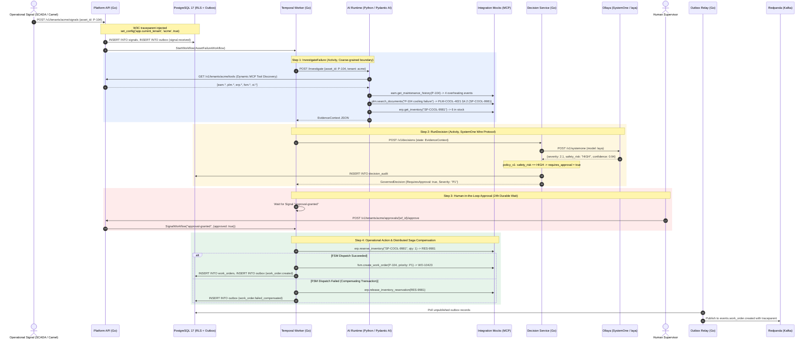
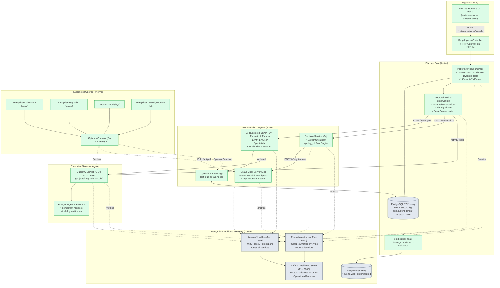

# Optimus: AI-Native Autonomous Enterprise Operations & Integration Platform

`optimus` is a portfolio-grade, production-shaped demonstration of an **AI-Native Enterprise Operations Platform**. It orchestrates the full operational lifecycle across mission-critical asset management, engineering knowledge, enterprise planning, and field dispatch:

```
Operational Signal (IoT / SCADA / Ingestion)
  → Intelligent Multi-Agent Investigation (MCP + Hybrid RAG)
  → Typed Decision Intelligence (SystemOne / Calibrated Forward Pass)
  → Governed Workflow Orchestration (Temporal + Human-in-the-Loop)
  → Resilient Enterprise Action (Distributed Saga Compensation)
  → Audited Event Streaming (Transactional Outbox + Kafka / Redpanda)
```

---

## 1. Vision & Architectural Philosophy

Modern enterprise organizations maintain deeply fragmented software stacks:
- **EAM (Enterprise Asset Management):** Asset health and maintenance histories.
- **PLM (Product Lifecycle Management):** Engineering blueprints, service manuals, and CAD specs.
- **ERP (Enterprise Resource Planning):** Warehouse inventory, spare parts availability, and procurement.
- **FSM (Field Service Management):** Work order scheduling and field technician dispatch.
- **OI (Operational Intelligence):** Real-time SCADA, telemetry streams, and vibration/temperature alerts.

When an anomaly occurs, resolving it requires cross-silo investigation, risk assessment, supervisor authorization, inventory reservation, and work order creation. Doing this manually creates downtime; delegating it completely to unconstrained LLMs causes hallucinations, unbounded loops, and un-auditable actions.

`optimus` provides an **AI-proposes, Decision-Intelligence-governs, Temporal-executes** architecture with Kubernetes Operator managing the infrastructure lifecycle.

---

## 2. Target "TO BE" Architecture & Technology Stack

The target architecture unifies cloud-native computing, AI agent tool protocols, enterprise integration patterns, and resilient state machines:

```mermaid
flowchart TB
    subgraph INGRESS["1. Ingress & Southbound Mediation Layer"]
        Sensors["Industrial IoT / SCADA<br/>(OPC-UA / Modbus / MQTT)"]
        LegacyBus["Legacy ERP / EAM<br/>(SOAP XML / SAP RFC / EDI)"]
        Camel["Apache Camel (EIP Engine)<br/>• Protocol Mediation & Normalization<br/>• Legacy-to-MCP Adapter<br/>• Content-Based Routing"]
        Kong["Kong Ingress Controller / API Gateway<br/>• TLS Termination & Rate Limiting<br/>• JWT / S2S Authentication"]
        User([Operations User / Supervisor])

        Sensors --> Camel
        LegacyBus <--> Camel
        User --> Kong
        Camel -->|"Normalized Events<br/>(JSON / HTTP POST)"| Kong
    end

    subgraph PLATFORM["2. Core Platform Layer (Go 1.26 / Temporal)"]
        Kong --> API["Platform API<br/>• Multi-Tenant Routing (TenantContext)<br/>• Dynamic Tool Discovery (/tools)<br/>• Approval Signal Endpoints"]
        API --> DB_Write[("PostgreSQL 17 Primary<br/>• Row-Level Security (RLS)<br/>• Transactional Outbox")]
        API --> TW["Temporal Worker<br/>• AssetFailureWorkflow DAG<br/>• 24h Durable HITL Timer<br/>• Distributed Saga Compensator"]
        OutboxRelay["cmd/outbox-relay<br/>• Reliable Outbox Poller<br/>• W3C Trace Injection"]
        DB_Write --> OutboxRelay
    end

    subgraph AI_DECISION["3. AI Investigation & Decision Intelligence"]
        TW -->|"1. Coarse Investigation<br/>POST /investigate"| AIRuntime["AI Runtime (Python 3.14 / uv)<br/>• Pydantic AI Orchestration<br/>• Planner + Specialist Agents<br/>• Dual LLM (Ollama / Anthropic)"]
        AIRuntime --> HybridRAG["Hybrid RAG Engine<br/>• pgvector Cosine Sim<br/>• PostgreSQL Full-Text Search (RRF)<br/>• Document Chunker & Embedder"]
        AIRuntime -.->|"Live Thinking Telemetry<br/>(Ephemeral Stream)"| NATS(["NATS Core Pub/Sub"])

        TW -->|"2. Governed Decision<br/>POST /v1/decisions"| DecisionSvc["Decision Service (Go)<br/>• SystemOne Wire Client<br/>• Deterministic Policy Engine (policy_v1)<br/>• Decision Audit Store"]
        DecisionSvc -->|"Single Forward Pass<br/>POST /v1/systemone"| JevOllaya["Decision Engine (JEV / Ollaya)<br/>• Model: laya (router)<br/>• Calibrated Probabilities<br/>• Typed Questions (score/choice/noul)"]
    end

    subgraph ENTERPRISE["4. Enterprise Integration & MCP Layer"]
        MCPGW["Model Context Protocol (MCP) Interface<br/>(JSON-RPC 2.0 Tools / Official Go MCP SDK)"]
        AIRuntime -->|Tool Discovery & Invocations| MCPGW
        TW -->|Activity Invocations & Sagas| MCPGW

        MCPGW --> MockEAM["EAM (Maintenance & Asset History)"]
        MCPGW --> MockPLM["PLM (Engineering & Cooling Manuals)"]
        MCPGW --> MockERP["ERP (Inventory Stock & Reservations)"]
        MCPGW --> MockFSM["FSM (Field Work Order Dispatch)"]
        MCPGW --> MockOI["OI (Real-time Telemetry Events)"]
        MCPGW <-->|Legacy Transcoding| Camel
    end

    subgraph STORAGE_EVENTS["5. Data, Events & Observability"]
        Postgres[("PostgreSQL 17 + pgvector<br/>• Tenant Schemas & RLS<br/>• document_chunks Partitioning<br/>• signals / work_orders / audit")]
        Redpanda[("Redpanda (Kafka Wire-Compatible)<br/>• events.work_order.created<br/>• Durable Replayable Event Log")]
        OTel["OpenTelemetry Collector + Jaeger<br/>• W3C TraceContext Propagation<br/>• Prometheus & Grafana Metrics"]
        ObjectStore[("S3 / MinIO Object Storage<br/>• Engineering Manuals & Blueprints")]

        DB_Write -.-> Postgres
        HybridRAG <--> Postgres
        OutboxRelay --> Redpanda
        ObjectStore --> HybridRAG
        PLATFORM -.-> OTel
        AI_DECISION -.-> OTel
        ENTERPRISE -.-> OTel
    end

    subgraph K8S_OPERATOR["6. Kubernetes Operator & Infra Lifecycle (controller-runtime)"]
        Operator["Optimus Kubernetes Operator"]
        CRD_Env["EnterpriseEnvironment CRD"]
        CRD_Integ["EnterpriseIntegration CRD"]
        CRD_Model["DecisionModel CRD"]
        CRD_Knowledge["EnterpriseKnowledgeSource CRD"]
        CRD_Policy["DecisionPolicy CRD"]

        CRD_Env --> Operator
        CRD_Integ --> Operator
        CRD_Model --> Operator
        CRD_Knowledge --> Operator
        CRD_Policy --> Operator

        Operator -.->|Reconciles Pods & NetworkPolicies| ENTERPRISE
        Operator -.->|Pulls & Warms Models /api/pull| JevOllaya
        Operator -.->|Schedules Ingestion Sync CronJobs| HybridRAG
    end

    classDef ingress fill:#f3e8fd,stroke:#7c3aed;
    classDef platform fill:#e0f2fe,stroke:#0284c7;
    classDef ai fill:#fef3c7,stroke:#d97706;
    classDef mcp fill:#ecfdf5,stroke:#059669;
    classDef data fill:#f1f5f9,stroke:#475569;
    classDef k8s fill:#fee2e2,stroke:#dc2626;

    class Sensors,LegacyBus,Camel,Kong,User ingress;
    class API,DB_Write,TW,OutboxRelay platform;
    class AIRuntime,HybridRAG,NATS,DecisionSvc,JevOllaya ai;
    class MCPGW,MockEAM,MockPLM,MockERP,MockFSM,MockOI mcp;
    class Postgres,Redpanda,OTel,ObjectStore data;
    class Operator,CRD_Env,CRD_Integ,CRD_Model,CRD_Knowledge,CRD_Policy k8s;
```



### Complete Technology Matrix

| Concern | Target Technology | Architectural Role |
|---|---|---|
| **EIP & Southbound Mediation** | **Apache Camel** | Listens to industrial protocols (OPC-UA, Modbus, MQTT), transforms legacy SOAP/RFC/EDI payloads to normalized JSON, and acts as an MCP-to-Legacy Enterprise Adapter. |
| **Workflow Orchestration** | **Temporal** | Owns the end-to-end durable business transaction, state machine, human approval timers (24h durable wait), and distributed Saga compensation. |
| **AI Agent Orchestration** | **Pydantic AI / Python 3.14+** | Structured multi-agent reasoning (Planner, EAM Specialist, PLM Specialist, ERP Specialist). Agents propose; they never mutate enterprise state directly. |
| **Tool Calling Standard** | **Model Context Protocol (MCP)** | Standardized JSON-RPC 2.0 tool interface (`eam.get_asset`, `plm.search_documents`, `erp.reserve_inventory`, `fsm.create_work_order`). |
| **Decision Intelligence** | **JEV / Ollaya (SystemOne API)** | Typed probabilistic decision server answering structured questions (`score`, `choice`, `noul`) in a single forward pass without free-form text hallucination. |
| **Knowledge Retrieval (RAG)** | **PostgreSQL 17 + pgvector + S3** | Hybrid retrieval (pgvector cosine similarity + Full-Text Search with Reciprocal Rank Fusion - RRF). Document sync managed from S3/MinIO via Operator. |
| **Infrastructure Lifecycle** | **Kubernetes Operator (Go)** | Declarative reconciliation of tenant environments (`EnterpriseEnvironment`), integration pods (`EnterpriseIntegration`), Ollaya warm models (`DecisionModel`), and ingestion jobs (`EnterpriseKnowledgeSource`). |
| **Durable Messaging** | **Redpanda (Kafka)** | Event-driven domain event log populated via the Transactional Outbox pattern (`events.work_order.created`). |
| **Live Agent Telemetry** | **NATS Core** | Ephemeral, stateless pub/sub streaming agent thinking steps to UI dashboards in real time without burdening the durable Kafka log. |
| **Multi-Tenancy & Security** | **PostgreSQL RLS + K8s RBAC** | Strict multi-tenancy enforced at the engine level (`set_config('app.current_tenant', $1, true)`), network isolation via `NetworkPolicy`, and W3C `traceparent` propagation. |
| **Edge Gateway** | **Kong Ingress Controller** | API routing, TLS termination, token verification, and rate limiting. |

---

## 3. End-to-End Walkthrough: Pump P-104 Asset Failure

### The Scenario
At the **Manchester Plant** (Tenant: `acme`), Centrifugal Pump **P-104** overheats for the 4th time in 30 days:
1. **Signal:** The telemetry ingestion pipeline receives an alert.
2. **Investigation:** The AI Planner queries maintenance history via EAM, performs hybrid semantic search over technical manuals in PLM (retrieving manual `PLM-COOL-4021 §4.2`), and confirms replacement thermostat `SP-COOL-9981` has 6 units in stock via ERP.
3. **Decisioning:** The SystemOne engine computes calibrated probabilities (`severity: 2.1`, `safety_risk: HIGH`, `field_visit_required: true`, `confidence: 0.94`). The policy engine enforces that `safety_risk == HIGH` unconditionally requires human authorization.
4. **Approval:** The workflow pauses durably in Temporal until an operations supervisor approves the action.
5. **Action & Saga:** Upon approval, inventory is reserved in ERP (`RES-9981`) and a field work order is dispatched in FSM (`WO-10423`). If FSM dispatch fails, automated Saga compensation immediately releases the ERP inventory reservation.
6. **Audit & Event:** An auditable event is emitted to Redpanda with W3C trace continuity in Jaeger.

### Sequence Diagram



---

## 4. Current Implementation Status ("AS IS" vs. "TO BE")

### 4.1 Current Architecture ("AS IS" Implemented Baseline)

The diagram below illustrates the actual components, protocols, and data pathways running in the Kind cluster today:



### 4.2 Implementation Gap Analysis (What is Built vs. What is Planned)

| Layer | Planned "TO BE" Architecture | Current "AS IS" Status | Notes / Tech Debt |
|---|---|---|---|
| **Southbound EIP** | **Apache Camel** mediation for industrial OPC-UA/MQTT and legacy SOAP/RFC systems | Direct HTTP JSON ingestion into Platform API | Camel sits in the TO BE layer for industrial PLC/SCADA plants; current demo ingests directly via REST. |
| **Workflow Engine** | **Temporal Go SDK** with state machines, 24h approval timer, and Saga compensation | **Fully Implemented (100%)** | `AssetFailureWorkflow`, signal channels, timers, and automatic rollback on FSM failure are working. `CreateFieldWorkOrder` persists the work order row and enqueues its `work_order.created` event atomically. |
| **AI Agent Framework** | **Pydantic AI** (Python) with Planner, Specialists, Dynamic Tool Discovery | **Fully Implemented (100%)** | Dynamic tool fetching from `/v1/tenants/{id}/tools`, structured `EvidenceContext` output. |
| **MCP Server Standard** | **Official Anthropic Go MCP SDK** (`github.com/modelcontextprotocol/go-sdk/mcp`) | Lightweight custom JSON-RPC 2.0 HTTP server with `/call-log` | Tracked in [TD-0001](docs/tech-debts/TD-0001-official-go-mcp-sdk-migration.md). Handles `tools/list` and `tools/call`. |
| **Decision Engine** | Real **Ollaya binary / JEV hosted service** (SystemOne API) | SystemOne Wire Client + **Go Ollaya Stub Server** | `decision-service` speaks real SystemOne protocol; `projects/ollaya` simulates the model locally for zero-cost CI. |
| **Object Storage (RAG)** | Real **AWS S3 / MinIO** for raw document ingestion | Operator creates Job running `ingest.py` on local fixture | Tracked in [TD-0002](docs/tech-debts/TD-0002-s3-minio-object-storage-ingestion.md). pgvector embeddings and chunking are fully working. |
| **Observability (Tracing)** | **OpenTelemetry SDK** + **Jaeger All-in-One** | **Fully Implemented (100%)** | Active across `platform`, `decision-service`, `integration-mocks`, `ollaya`, and `ai-runtime` with W3C TraceContext propagation. |
| **Observability (Metrics)** | **Prometheus** (v2.54) scraping `/metrics` on all services | **Fully Implemented (100%)** | Active targets: Platform API, Decision Service, Integration Mocks, Ollaya. |
| **Observability (Dashboards)** | **Grafana** (v11.2) with auto-provisioned dashboards | **Fully Implemented (100%)** | Auto-provisions Prometheus & Jaeger datasources and `Optimus - Enterprise Operations Overview` dashboard. |
| **Event Streaming** | **Redpanda** (Kafka wire-compatible) + Transactional Outbox | **Fully Implemented (100%)** | `cmd/outbox-relay` polls the PostgreSQL outbox and publishes via `franz-go` with the W3C `traceparent` carried as a record header. Work orders and their `work_order.created` event are written in a single transaction, so the event cannot diverge from the row. |
| **Agent Telemetry** | **NATS Core** for live ephemeral agent thinking streams | Architectural Design Complete | Designed in ADR-0006; scheduled for Phase 9 live operations dashboard. |
| **Kubernetes Operator** | Reconciles `EnterpriseEnvironment`, `EnterpriseIntegration`, `DecisionModel`, `EnterpriseKnowledgeSource` | **Fully Implemented (100%)** | Kubebuilder controllers, CRD YAMLs, sample manifests, and envtest unit tests passing. |
| **Multi-Tenant Security** | PostgreSQL 17 **Row-Level Security (RLS)** via `TenantContext` | **Fully Implemented (100%)** | Database-level isolation blocks cross-tenant reads/writes. |

---

## 5. Developer Guide & Getting Started

### 5.1 Prerequisites

**Toolchain** — [mise](https://mise.jdx.dev/) pins and installs everything else:

| Tool | Pinned version |
|---|---|
| Go | `1.26` |
| Python | `3.14` (`uv`-managed) |
| Node | `24` |
| `kubectl` | latest |
| `kind` | latest |
| `kustomize` | latest |
| `helm`, `buf`, `sqlc`, `goose`, `golangci-lint`, `lefthook` | latest |

**Container runtime** — any Docker-compatible runtime with ≥8 GB RAM allocated. Verified against **Colima**, **OrbStack**, and Docker Desktop.

**macOS host tooling** (only needed for the trusted `*.optimus.local` TLS environment, §5.4):

```bash
brew install mkcert nss dnsmasq
mkcert -install    # adds the local CA to the macOS trust store
```

### 5.2 Quick Start

One command provisions everything — cluster, images, stack, migrations, fixtures:

```bash
mise install
mise run bootstrap
mise run setup          # kind-create → build → deploy (runs the migrate & seed Jobs)
```

Or step by step, if you want to see each stage:

```bash
mise run kind-create    # Kind cluster + local registry + ingress-nginx + TLS + DNS
mise run build          # build & push all service images to localhost:5001
mise run deploy         # apply Kustomize manifests (kind-dev overlay)
mise run migrate        # goose migrations — already run by `deploy`, re-runnable
mise run seed           # fixtures — already run by `deploy`, re-runnable
```

Verify, then exercise the system:

```bash
mise run ingress:verify # all TLS endpoints + wildcard DNS
mise run test           # fast unit & contract tests — no cluster needed
mise run e2e:live       # full acceptance suite against the live cluster
mise run demo           # interactive terminal walkthrough
```

`mise run e2e:live` runs against the real cluster and asserts the whole trail, not just
that the services responded. It sets up port-forwards to the platform, decision service,
integration mocks, Redpanda and Jaeger, then verifies:

| Step | Assertion |
|---|---|
| 6 | the `work_order.created` event is consumable from Redpanda, keyed by the workflow id |
| 7 | that Kafka record carries the `traceparent` of the request that caused it |
| 8 | the platform audit trail returns the signal and the work order under one correlation id |
| 9 | the decision audit persisted the policy version that governed the decision |
| 10 | one Jaeger trace contains `IngestSignal`, `RunDecision` and `fsm.create_work_order` |

Step 10 is the sharp one: the worker registers no Temporal tracing interceptor, so without
the traceparent being threaded explicitly through each activity those spans land in
disconnected traces instead of the workflow's. It fails if that plumbing regresses.

Steps 6–10 need the real stack and are skipped when running without `LIVE_CLUSTER=true`;
that mode uses in-process mocks and stays fast enough for a pre-commit hook.

### 5.3 Task Reference

<details>
<summary><b>Lifecycle</b></summary>

| Command | Description |
|---|---|
| `mise run setup` | One-shot master bootstrap: `kind-create` → `build` → `deploy` (the migrate & seed Jobs run as part of `deploy`) |
| `mise run bootstrap` | Install dependencies for every sub-project (`go mod download`, `uv sync`, `lefthook install`) |
| `mise run kind-create` | Create the Kind cluster with registry mirror, ingress-nginx, TLS and DNS |
| `mise run kind-destroy` | Destroy the Kind cluster and local registry |
| `mise run clean` | Clean up the local dev environment |

</details>

<details>
<summary><b>Build & Deploy</b></summary>

| Command | Description |
|---|---|
| `mise run build` | Build all container images and push them to `localhost:5001` |
| `mise run deploy` | Deploy base infrastructure and services (defaults to `kind-dev`) |
| `mise run deploy:dev` | Deploy to the local Kind cluster using the `kind-dev` overlay |
| `mise run deploy:ci` | Deploy to a CI Kind cluster using the `kind-ci` overlay |
| `mise run crds-install` | Install the Kubernetes Operator CRDs |
| `mise run migrate` | Apply database schema migrations (goose) |
| `mise run seed` | Seed operational fixtures (tenants, assets, documents) |

</details>

<details>
<summary><b>Local environment: TLS, DNS & certificates</b> (§5.4)</summary>

| Command | Description |
|---|---|
| `mise run ingress:up` | Install ingress-nginx, TLS certificates and dnsmasq (idempotent) |
| `mise run ingress:all` | Create TLS Ingresses for all deployed services |
| `mise run ingress:dns` | Set up dnsmasq wildcard DNS for `*.optimus.local` |
| `mise run ingress:certs` | Issue or renew the wildcard certificate and sync it into the cluster |
| `mise run ingress:certs-force` | Force-regenerate the certificate (drops the existing key pair) |
| `mise run ingress:verify` | Verify DNS resolution and all TLS endpoints |
| `mise run ingress:down` | Tear down Kind ingress and cluster |

</details>

<details>
<summary><b>Test, lint & demo</b></summary>

| Command | Description |
|---|---|
| `mise run test` | Fast tests across all projects — no Kind required |
| `mise run lint` | Run linters across all projects |
| `mise run e2e` | Run full Kind E2E scenarios |
| `mise run e2e:live` | Run E2E tests against the live cluster using port-forwards |
| `mise run demo` | Run the interactive live cluster demo against real endpoints |
| `mise run demo:mock` | Run the offline simulation demo (no cluster needed) |

</details>

### 5.4 Local Development Environment — Trusted TLS & Wildcard DNS

Every service is reachable over HTTPS on its own hostname, with certificates the OS and browsers actually trust, and DNS that needs no `/etc/hosts` edits.

| Service | URL | Notes |
|---|---|---|
| **Kong API Gateway** | https://api.optimus.local/v1/ | Platform API entry point |
| **Platform API** | https://platform.optimus.local | Direct API access |
| **Decision Service** | https://decision.optimus.local | Typed decisions (`/v1/decisions`) |
| **Grafana** | https://grafana.optimus.local | admin / admin |
| **Prometheus** | https://prometheus.optimus.local | Metric queries |
| **Jaeger** | https://jaeger.optimus.local | Distributed traces |
| **Redpanda Admin** | https://redpanda.optimus.local | Kafka admin API |

**How it works**

- **DNS** — `dnsmasq` serves the wildcard `address=/.optimus.local/127.0.0.1` from `$(brew --prefix)/etc/dnsmasq.d/optimus.conf`, and `/etc/resolver/optimus.local` routes the TLD to it. Adding a service later needs no DNS change at all.
- **TLS** — a single mkcert wildcard certificate covers `optimus.local`, `*.optimus.local`, `localhost`, `127.0.0.1` and `::1`. It is kept in `~/.kind-certs/` and synced into the `optimus-local-tls` Secret in each namespace. ingress-nginx terminates TLS — no host-side proxy.
- **Validity** — the certificate is re-issued automatically when a SAN is missing, the key pair does not match, or fewer than 60 days of validity remain.

**Adding a service** requires only an Ingress — DNS and TLS are already wildcarded:

```bash
./scripts/setup-kind-ingress.sh ingress temporal-ui optimus temporal 8233 temporal.optimus.local
# https://temporal.optimus.local works immediately
```

> **⚠️ Two keychains, two browser families.** macOS has two trust stores and browsers do not read them equally:
>
> | Keychain | Read by | Script installs? |
> |---|---|---|
> | `login.keychain-db` | Safari, `curl` (SecureTransport) | Yes — no sudo needed |
> | `/Library/Keychains/System.keychain` | **Chrome / Brave / Edge** (Chromium-based) | Yes — **sudo required** |
>
> If a Chromium browser rejects the certificate while Safari loads it fine, the CA is missing from the System keychain. `mise run ingress:certs` detects this and prints the exact command. After installing, **quit the browser completely (Cmd+Q — closing the window is not enough)**: Chromium reads the trust store only at startup.

**Confirming where a problem lies** — `security verify-cert` calls the same `SecTrustEvaluate` engine the browsers use, so it separates server faults from client-side trust:

```bash
echo | openssl s_client -servername grafana.optimus.local -connect 127.0.0.1:443 2>/dev/null \
  | openssl x509 -outform PEM > /tmp/served.crt
security verify-cert -c /tmp/served.crt -p ssl -n grafana.optimus.local
# "...certificate verification successful." → the server and trust chain are fine
```

Full details, including dnsmasq troubleshooting and certificate internals, are in [`docs/dev-environment.md`](docs/dev-environment.md).

---

## 6. Architecture Decision Records (ADRs) & Specs

All architectural boundaries and trade-offs are rigorously documented:
- [`PRD.md`](PRD.md): Product Requirements Document and operating specifications.
- [`AGENTS.md`](AGENTS.md): Repository conventions, architectural boundaries, and commands.
- [`docs/adr/`](docs/adr/): Architecture Decision Records covering Hybrid RAG, MCP Adapters, Decision Policies, Dual Messaging (Redpanda/NATS), and Multi-Tenant Isolation.
- [`docs/stories/`](docs/stories/): Detailed story specifications and Gherkin acceptance criteria.
