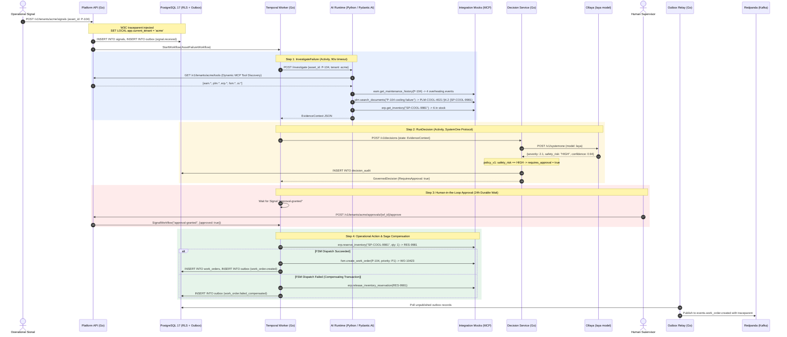

# STORY-0001: Asset Failure Investigation, Typed Decisioning, and Governed Operational Dispatch

| Field | Value |
|---|---|
| **Story ID** | `STORY-0001` |
| **Title** | Asset Failure Investigation, Typed Decisioning, and Governed Operational Dispatch |
| **Status** | Approved / Baseline Implemented |
| **Epic** | Autonomous Enterprise Operations & Agentic Integrations |
| **Primary Scenario** | Centrifugal Pump P-104 Overheating (Manchester Plant, Tenant: Acme) |

---

## 1. Executive Summary & Business Problem

When a physical machine or factory asset triggers repeated anomaly signals, contemporary enterprise operations suffer from fragmented diagnostics: maintenance history resides in EAM (e.g., IFS Cloud / Maximo), technical manuals are siloed in PLM (e.g., Teamcenter), spare parts are tracked in ERP (e.g., SAP), and field technician scheduling lives in FSM.

**STORY-0001** implements the core vertical loop of the `optimus` platform:
1. **Signal Ingestion:** An anomaly signal is received with tenant context and W3C trace headers.
2. **AI Investigation:** A Planner Agent coordinates specialist agents over Model Context Protocol (MCP) to collect evidence from EAM, search engineering manuals via Hybrid RAG (pgvector + FTS), and verify ERP warehouse stock.
3. **Typed Decision Intelligence:** Collected evidence is passed to `decision-service`, querying an Ollaya model over the TypeSafe/SystemOne wire protocol, followed by deterministic policy evaluation (`policy_v1`).
4. **Governed Durable Execution:** A Temporal workflow pauses for supervisor human approval if `safety_risk == HIGH`, then reserves the spare part in ERP and creates a field work order in FSM.
5. **Distributed Saga Compensation:** If FSM work order creation fails, the workflow executes automated compensation (`ReleaseSparePartReservation`) to prevent inventory locking.
6. **Audit & Event Streaming:** Every state mutation is recorded in PostgreSQL under Row-Level Security (RLS) and published to Redpanda via the Transactional Outbox pattern.

---

## 2. Acceptance Criteria & Tests (Gherkin Specification)

### Scenario 1.1: Happy Path — Investigation, Decision, Human Approval, and Work Order Creation
```gherkin
Given a deployed EnterpriseEnvironment "acme-demo" in status "Ready"
  And asset "P-104" exists at plant "Manchester" under tenant "acme"
  And PLM manual "PLM-COOL-4021 §4.2" states thermostat part "SP-COOL-9981" is required
  And ERP warehouse holds 6 units of part "SP-COOL-9981"
 When an operational signal is POSTed to "/v1/tenants/acme/signals" with symptom "repeated overheating"
 Then Platform API returns HTTP 202 with "signal_id" and "workflow_id"
  And a "signal.received" event is queued in the PostgreSQL "outbox" table with traceparent preserved
  And Temporal workflow "AssetFailureWorkflow" enters state "AwaitingApproval"
  And the Decision Service records an audit entry with:
    | field                 | expected value                                                    |
    | severity              | "P1"                                                              |
    | safety_risk           | "HIGH"                                                            |
    | field_visit_required  | true                                                              |
    | confidence            | >= 0.90                                                           |
    | requires_approval     | true                                                              |
    | policy_version        | "policy_v1"                                                       |
 When human approval is POSTed to "/v1/tenants/acme/approvals/{workflow_id}/approve"
 Then Temporal receives the "approval-granted" signal
  And ERP mock receives an idempotent tool call "erp.reserve_inventory" returning reservation "RES-9981"
  And FSM mock receives an idempotent tool call "fsm.create_work_order" returning work order "WO-10423"
  And a "work_order.created" event is committed to the "outbox" table
  And workflow terminates in state "COMPLETED"
```

### Scenario 1.2: Rejection Flow — Human Supervisor Rejection
```gherkin
Given an active workflow paused in "AwaitingApproval" for asset "P-104"
 When the supervisor denies approval or the 24-hour timer expires
 Then the workflow terminates in state "REJECTED"
  And NO tool calls are made to "erp.reserve_inventory" or "fsm.create_work_order"
  And no work order row is inserted into PostgreSQL
```

### Scenario 1.3: Distributed Saga Compensation — FSM Dispatch Failure
```gherkin
Given approval has been granted for asset "P-104"
  And ERP spare part "SP-COOL-9981" has been reserved with ID "RES-9981"
 When the "fsm.create_work_order" activity fails permanently (exhausting max attempts)
 Then the workflow triggers compensating activity "ReleaseSparePartReservation"
  And ERP mock receives tool call "erp.release_inventory_reservation" for "RES-9981"
  And an outbox message "work_order.failed_compensated" is recorded
  And the workflow terminates in state "FAILED_COMPENSATED" with "compensated: true"
```

### Scenario 1.4: Multi-Tenant Data Isolation (PostgreSQL RLS)
```gherkin
Given tenant "acme" has signals and work orders in the database
 When tenant "globex" attempts to query or write records belonging to "acme"
 Then PostgreSQL Row-Level Security blocks the query at the engine level
  And the request returns HTTP 401 or an empty record set
```

---

## 3. Technical Architecture & Component Interaction



---

## 4. Service-by-Service Implementation Specifications

### 4.1 `projects/platform` (Enterprise Backend & Temporal Orchestrator)
- **Role:** Edge API, multi-tenant boundary, durable workflow orchestrator, and transactional event publisher.
- **Key Modules:**
  - `internal/tenant`: `TenantContext` propagation, HTTP middleware checking `X-Tenant-ID` or URL path, and executing `SET LOCAL app.current_tenant` on PostgreSQL connections.
  - `internal/workflow`:
    - `AssetFailureWorkflow`: Orchestrates activities in deterministic Go code.
    - `activities.go`: `InvestigateFailure` (HTTP client with 90s timeout), `RunDecision` (HTTP client to decision-service), `ReserveSparePart` (ERP MCP call), `CreateFieldWorkOrder` (FSM MCP call), and `ReleaseSparePartReservation` (Saga rollback).
  - `internal/infra/outbox`: Periodic relay polling unpublished rows from `outbox` table and publishing to Redpanda via Kafka wire protocol with W3C `traceparent` headers.
- **Exposed Endpoints:**
  - `POST /v1/tenants/{tenant_id}/signals`: Ingests anomaly signal, triggers workflow.
  - `GET /v1/tenants/{tenant_id}/tools`: Returns active MCP tools for tenant.
  - `POST /v1/tenants/{tenant_id}/approvals/{workflow_id}/approve`: Sends approval signal to Temporal.
  - `GET /healthz`: Kubernetes liveness/readiness probe.

### 4.2 `projects/decision-service` (Typed Decisioning & Policy Enforcement)
- **Role:** Wire adapter to Ollaya / TypeSafe SystemOne decision models and deterministic business rule gatekeeper.
- **Key Modules:**
  - `internal/systemone`: Speaks `POST /v1/systemone` wire protocol with typed questions (`score`, `choice`, `noul`).
  - `internal/policy`: `policy_v1` rules engine:
    - If `safety_risk == "HIGH"`, sets `RequiresApproval = true`.
    - If `Confidence < 0.75`, sets `RequiresApproval = true`.
  - `internal/audit`: Writes complete inference input, raw model response, policy outcome, and policy version to `decision_audit` table.
- **Exposed Endpoints:**
  - `POST /v1/decisions`: Evaluates evidence and returns `GovernedDecision`.
  - `GET /healthz`: Liveness/readiness check.

### 4.3 `projects/ai-runtime` (Agent Orchestration & Hybrid RAG)
- **Role:** Agent planning and multi-system evidence retrieval. AI proposes, but never mutates enterprise state directly.
- **Key Modules:**
  - `src/optimus_ai/mcp/client.py`: Calls Platform API to discover active tools for tenant, then executes JSON-RPC 2.0 tool calls against mock services.
  - `src/optimus_ai/agents/specialists.py`: `EAMSpecialist`, `PLMSpecialist`, `ERPSpecialist`.
  - `src/optimus_ai/rag/retriever.py`: Hybrid search simulation / pgvector cosine similarity.
  - `src/optimus_ai/llm/provider.py`: Dual LLM abstraction: `MockProvider` for deterministic CI, `OllamaProvider` for local dev, `AnthropicProvider` for production demo.
  - `src/optimus_ai/agents/planner.py`: Assembles structured `EvidenceContext` JSON.
- **Exposed Endpoints:**
  - `POST /investigate`: Accepts asset ID and symptom, returns structured `EvidenceContext`.
  - `GET /healthz`: Health check.

### 4.4 `projects/integration-mocks` (Enterprise Systems & MCP Server)
- **Role:** Production-shaped mocks for EAM, PLM, ERP, FSM, and Operational Intelligence.
- **Key Modules:**
  - `internal/mcpserver`: Generic JSON-RPC 2.0 HTTP server handling `tools/list`, `tools/call`, and `/call-log`.
  - `internal/eam`: Implements `eam.get_asset` and `eam.get_maintenance_history` (4 failures / 30 days).
  - `internal/plm`: Implements `plm.search_documents` (returns PLM-COOL-4021 §4.2).
  - `internal/erp`: Implements `erp.get_inventory`, `erp.reserve_inventory` (`RES-9981`), and `erp.release_inventory_reservation`.
  - `internal/fsm`: Implements `fsm.create_work_order` (`WO-P-104-10423`).
  - `internal/oi`: Implements `oi.get_recent_events` (critical temperature telemetry).

### 4.5 `projects/operator` (Kubernetes Infrastructure Lifecycle)
- **Role:** Declarative environment and model lifecycle management. Never touches business workflows or databases.
- **Key Custom Resources:**
  - `EnterpriseEnvironment`: Top-level tenant declaration. Fans out child integrations.
  - `EnterpriseIntegration`: Manages mock deployment and Service endpoints.
  - `DecisionModel`: Manages Ollaya model pull (`/api/pull`) and warm residency (`keepAlive: "-1"`).

---

## 5. Database Schemas, Tables, and State Transitions

### Database Tables (PostgreSQL 17 with RLS)

```sql
-- 1. Tenants Table
CREATE TABLE tenants (
    id VARCHAR(64) PRIMARY KEY,
    name VARCHAR(255) NOT NULL,
    created_at TIMESTAMPTZ NOT NULL DEFAULT NOW()
);

-- 2. Assets Table (RLS Enabled)
CREATE TABLE assets (
    id VARCHAR(64) NOT NULL,
    tenant_id VARCHAR(64) NOT NULL REFERENCES tenants(id) ON DELETE CASCADE,
    name VARCHAR(255) NOT NULL,
    asset_type VARCHAR(128) NOT NULL,
    plant VARCHAR(128) NOT NULL,
    status VARCHAR(64) NOT NULL DEFAULT 'OPERATIONAL',
    created_at TIMESTAMPTZ NOT NULL DEFAULT NOW(),
    PRIMARY KEY (tenant_id, id)
);

-- 3. Operational Signals Table (RLS Enabled)
CREATE TABLE signals (
    id VARCHAR(64) NOT NULL,
    tenant_id VARCHAR(64) NOT NULL REFERENCES tenants(id) ON DELETE CASCADE,
    asset_id VARCHAR(64) NOT NULL,
    symptom TEXT NOT NULL,
    status VARCHAR(64) NOT NULL DEFAULT 'INGESTED',
    workflow_id VARCHAR(128),
    created_at TIMESTAMPTZ NOT NULL DEFAULT NOW(),
    PRIMARY KEY (tenant_id, id)
);

-- 4. Work Orders Table (RLS Enabled)
CREATE TABLE work_orders (
    id VARCHAR(64) NOT NULL,
    tenant_id VARCHAR(64) NOT NULL REFERENCES tenants(id) ON DELETE CASCADE,
    asset_id VARCHAR(64) NOT NULL,
    priority VARCHAR(32) NOT NULL,
    status VARCHAR(64) NOT NULL DEFAULT 'OPEN',
    idempotency_key VARCHAR(128) NOT NULL UNIQUE,
    created_at TIMESTAMPTZ NOT NULL DEFAULT NOW(),
    PRIMARY KEY (tenant_id, id)
);

-- 5. Transactional Outbox Table (RLS Enabled)
CREATE TABLE outbox (
    id BIGSERIAL PRIMARY KEY,
    tenant_id VARCHAR(64) NOT NULL REFERENCES tenants(id) ON DELETE CASCADE,
    event_type VARCHAR(128) NOT NULL,
    correlation_id VARCHAR(128) NOT NULL,
    traceparent VARCHAR(255),
    payload JSONB NOT NULL,
    published_at TIMESTAMPTZ,
    created_at TIMESTAMPTZ NOT NULL DEFAULT NOW()
);

-- 6. Decision Audit Table (RLS Enabled)
CREATE TABLE decision_audit (
    id BIGSERIAL PRIMARY KEY,
    tenant_id VARCHAR(64) NOT NULL,
    decision_id VARCHAR(128) NOT NULL UNIQUE,
    asset_id VARCHAR(64) NOT NULL,
    model VARCHAR(64) NOT NULL,
    state_payload JSONB NOT NULL,
    raw_response JSONB NOT NULL,
    governed_decision JSONB NOT NULL,
    policy_version VARCHAR(32) NOT NULL,
    requires_approval BOOLEAN NOT NULL,
    created_at TIMESTAMPTZ NOT NULL DEFAULT NOW()
);
```

### Event Streaming Contract (Redpanda)
- **Topic:** `events.work_order.created`
- **Key:** Correlation ID (`workflow_id`)
- **Headers:** `traceparent: 00-4bf92f3577b34da6a3ce929d0e0e4736-00f067aa0ba902b7-01`, `tenant_id: acme`
- **Payload Schema:**
  ```json
  {
    "work_order_id": "WO-P-104-10423",
    "asset_id": "P-104",
    "tenant_id": "acme",
    "reservation_id": "RES-SP-COOL-9981-wf-run",
    "timestamp": "2026-09-26T11:00:00Z"
  }
  ```

---

## 6. Edge Cases & Error Handling

| # | Edge / Error Case | Root Cause / Condition | Mitigation & System Behavior |
|---|---|---|---|
| **E1** | **FSM Service Down / Dispatch Failure** | Network timeout or technician pool exhausted during `CreateFieldWorkOrder`. | **Saga Compensation:** Temporal catches error in `AssetFailureWorkflow`, calls `ReleaseSparePartReservation(RES-9981)` via disconnected context, unreserves inventory in ERP, writes `work_order.failed_compensated` to outbox, and terminates cleanly with `status: FAILED_COMPENSATED`. |
| **E2** | **Low Decision Confidence (<0.75)** | Sensor data noisy or unexpected symptoms. | **Policy Gate:** Regardless of predicted severity, `policy_v1` detects `confidence < 0.75` and unconditionally forces `requires_approval = true`. |
| **E3** | **Supervisor Inaction / 24h Timeout** | Human approver does not respond to approval request. | **Temporal Timer:** `workflow.NewTimer(24 * time.Hour)` triggers, approval defaults to `false`, and workflow transitions to terminal state `REJECTED` without reserving parts or creating work orders. |
| **E4** | **Cross-Tenant Data Leak Attempt** | Malicious or buggy request uses `X-Tenant-ID: globex` while querying asset `P-104` (owned by `acme`). | **PostgreSQL RLS:** Engine evaluates `tenant_id = current_setting('app.current_tenant')`, immediately returning empty result or rejection at the SQL driver level. |
| **E5** | **Duplicate Signal Submission** | Network retry submits identical anomaly twice within seconds. | **Idempotency Protection:** Signals table enforces unique constraint, and ERP/FSM tool calls use Temporal `WorkflowRunID` as idempotency keys. Duplicate tool calls return the cached response without double-booking inventory. |

---

## 7. How to Test & Verification Guide

### 7.1 Fast Unit & Contract Tests (No Cluster Required)
Runs race-detector enabled unit and contract tests across all 5 Go projects and Python in under 5 seconds:
```bash
# Run all unit tests
mise run test

# Run linters
mise run lint
```

### 7.2 Running Migrations & Seeding as Kubernetes Jobs
```bash
# Apply migrations job
mise run migrate

# Seed Acme and Pump P-104 fixtures
mise run seed
```

### 7.3 Executing End-to-End Test Suite Against Live Kind Cluster
```bash
# Runs port-forwarding and executes Ginkgo test suite against live cluster pods
mise run e2e:live

# Or execute standalone e2e suite with mock servers:
mise run e2e
```

### 7.4 Running the Interactive Terminal Demo
Exercises the entire flow interactively with colored terminal output and generates a clickable Jaeger trace link:
```bash
./scripts/demo.sh
# Or via mise:
mise run demo
```

---

## 8. TASKS — Step-by-Step Implementation Breakdown

### `projects/platform`
- [x] Implement `internal/tenant/context.go`: `TenantContext` injection, HTTP middleware, and `SET LOCAL app.current_tenant`.
- [x] Implement `internal/domain/models.go`: Domain models for `Signal`, `WorkOrder`, `OutboxMessage`, `Tool`.
- [x] Implement `internal/app/service.go`: Signal ingestion logic, RLS-aware storage, and outbox event enqueueing.
- [x] Implement `internal/transport/http_handler.go`: HTTP endpoints (`/signals`, `/tools`, `/approvals/{id}/approve`).
- [x] Implement `internal/infra/outbox/relay.go`: Transactional outbox polling and dispatching.
- [x] Implement `internal/workflow/types.go` & `activities.go`: Temporal activity definitions.
- [x] Implement `internal/workflow/workflow.go`: `AssetFailureWorkflow` with 24h approval timer and Saga compensation.
- [x] Implement `internal/workflow/workflow_test.go`: Temporal TestSuite tests for happy path and Saga rollback.
- [x] Implement `cmd/api/main.go` and `cmd/worker/main.go`.
- [x] Implement `Dockerfile` for Platform container image.

### `projects/decision-service`
- [x] Implement `internal/systemone/client.go`: TypeSafe/SystemOne wire protocol client (`POST /v1/systemone`).
- [x] Implement `internal/policy/engine.go`: `policy_v1` deterministic rule engine.
- [x] Implement `internal/audit/audit.go`: `decision_audit` data models and repository.
- [x] Implement `internal/decision/service.go`: Orchestrator linking SystemOne client, policy engine, and audit.
- [x] Implement `internal/http/handler.go` & `cmd/main.go`: `POST /v1/decisions` HTTP endpoint.
- [x] Implement unit tests in `internal/decision/service_test.go`.
- [x] Implement `Dockerfile` for Decision Service container image.

### `projects/integration-mocks`
- [x] Implement `internal/mcpserver/server.go`: JSON-RPC 2.0 / MCP HTTP server (`tools/list`, `tools/call`, `/call-log`).
- [x] Implement `internal/eam/service.go`: `eam.get_asset` and `eam.get_maintenance_history`.
- [x] Implement `internal/plm/service.go`: `plm.search_documents` with PLM-COOL-4021 §4.2 findings.
- [x] Implement `internal/erp/service.go`: `erp.get_inventory`, `erp.reserve_inventory`, `erp.release_inventory_reservation`.
- [x] Implement `internal/fsm/service.go`: `fsm.create_work_order`.
- [x] Implement `internal/oi/service.go`: `oi.get_recent_events`.
- [x] Implement `cmd/main.go` with multi-system CLI flag.
- [x] Implement unit tests in `internal/mcpserver/server_test.go`.
- [x] Implement `Dockerfile` for Enterprise Mocks container image.

### `projects/operator`
- [x] Initialize kubebuilder project structure and `api/v1alpha1`.
- [x] Implement CRD types: `EnterpriseEnvironment`, `EnterpriseIntegration`, `DecisionModel`.
- [x] Implement controllers: `EnterpriseEnvironmentReconciler`, `EnterpriseIntegrationReconciler`, `DecisionModelReconciler`.
- [x] Implement controller unit tests using controller-runtime fake client.
- [x] Generate CRD YAML manifests in `config/crd/`.
- [x] Implement `Dockerfile` for Operator container image.

### `projects/ai-runtime`
- [x] Scaffold Python 3.12/3.14 project with `uv` and `pyproject.toml`.
- [x] Implement `src/optimus_ai/mcp/client.py`: Dynamic tool discovery and execution.
- [x] Implement `src/optimus_ai/rag/retriever.py`: Hybrid search matching.
- [x] Implement `src/optimus_ai/llm/provider.py`: Dual LLM provider (`MockProvider`, `OllamaProvider`, `AnthropicProvider`).
- [x] Implement `src/optimus_ai/agents/specialists.py`: EAM, PLM, ERP specialists.
- [x] Implement `src/optimus_ai/agents/planner.py`: Planner Agent producing `EvidenceContext`.
- [x] Implement `src/optimus_ai/main.py`: FastAPI application exposing `POST /investigate`.
- [x] Implement pytest suite in `tests/test_planner.py`.
- [x] Implement `Dockerfile` for AI Runtime container image.

### `e2e` & `deployments`
- [x] Implement Ginkgo/Gomega E2E test harness in `e2e/suite/` and `e2e/scenarios/asset-failure/`.
- [x] Support dual-mode execution (live cluster vs. self-contained mocks).
- [x] Define K8s base manifests in `deployments/base/` for all infrastructure and application services.
- [x] Implement `deployments/base/postgres/migration-job.yaml` and `seed-job.yaml` with `initContainers`.
- [x] Implement `deployments/tenants/acme/` Kustomize package.
- [x] Implement `deployments/overlays/kind-dev/` and `deployments/overlays/kind-ci/`.
- [x] Implement `scripts/build.sh`, `scripts/deploy.sh`, `scripts/migrate.sh`, `scripts/seed.sh`, `scripts/setup.sh`, `scripts/test-e2e-live.sh`, `scripts/demo.sh`.
- [x] Configure `.github/workflows/build-and-test.yaml` and `.github/workflows/cleanup-artifacts.yaml`.
