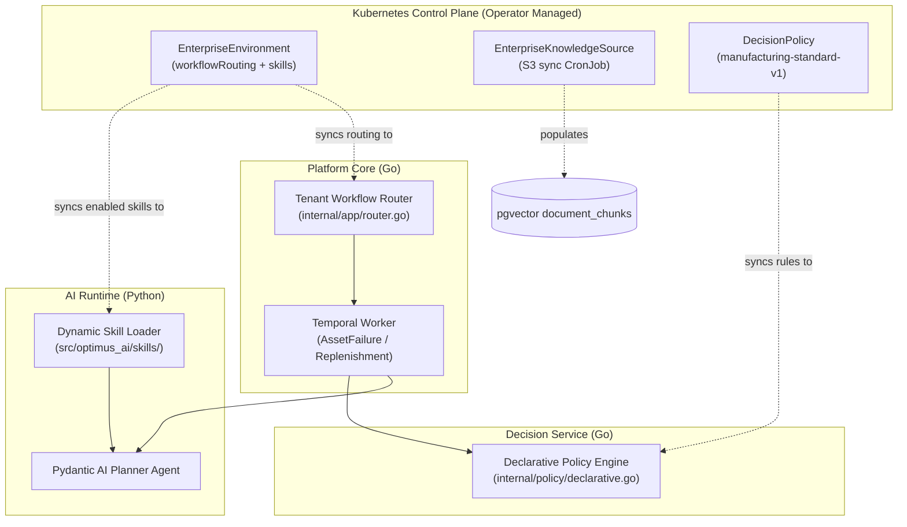

# STORY-0002: Tenant-Specific Workflow Routing, Declarative Agent Skills, and Operator Knowledge Ingestion

| Field | Value |
|---|---|
| **Story ID** | `STORY-0002` |
| **Title** | Tenant-Specific Workflow Routing, Declarative Agent Skills, and Operator Knowledge Ingestion |
| **Status** | Approved / Specified |
| **Epic** | Autonomous Enterprise Operations & Multi-Tenant Extensibility |
| **Related ADRs** | ADR-0001, ADR-0002, ADR-0003, ADR-0005, ADR-0006, ADR-0007 |

---

## 1. Executive Summary & Business Problem

In enterprise environments (such as IFS Cloud customer estates across utilities, manufacturing, and aerospace), different enterprise tenants enforce distinct operational procedures:
- Some tenants require automated spare part reordering without human intervention for non-critical assets.
- Other tenants require strict dual-human approval on all thermal anomalies.
- New enterprise systems (e.g., Asset Investment Planning / AIP) must be integrated without redeploying or recompiling the core application or AI runtime services.

**STORY-0002** operationalizes the architectural decisions from ADR-0001 through ADR-0007:
1. **Dynamic Workflow Routing:** The Platform API maps incoming signals to specific Temporal workflows (`AssetFailureWorkflow`, `AutonomousReplenishmentWorkflow`) using the tenant's declarative `workflowRouting` configuration from `EnterpriseEnvironment`.
2. **Declarative Agent Skills:** The AI Runtime dynamically loads `AgentSkill` manifests (`contracts/skills/*.yaml`) matching the tenant's enabled skill set, configuring the Pydantic AI Planner without custom Python code.
3. **Operator-Managed Knowledge Ingestion:** The Kubernetes Operator reconciles `EnterpriseKnowledgeSource` CRDs by provisioning background ingestion CronJobs that synchronize S3/SharePoint documentation into tenant-partitioned `pgvector` tables.
4. **Declarative Policy Governance:** The Decision Service evaluates model inferences against tenant-specific `DecisionPolicy` CRDs, enforcing customized risk tolerances and financial boundaries.

---

## 2. Acceptance Criteria & Tests (Gherkin Specification)

### Scenario 2.1: Dynamic Workflow Routing via Tenant CRD Configuration
```gherkin
Given tenant "acme" has an EnterpriseEnvironment resource declaring:
    | signalPattern               | workflowName                    | parameters                      |
    | "telemetry.anomaly.thermal" | "AssetFailureWorkflow"          | autoApproveThreshold: 0.95      |
    | "inventory.stock.critical"  | "AutonomousReplenishmentWorkflow"| maxAutoBudgetUSD: 1000          |
 When an operational signal of type "inventory.stock.critical" is ingested
 Then the Platform API queries "tenant_workflow_routes"
  And initiates "AutonomousReplenishmentWorkflow" instead of "AssetFailureWorkflow"
  And passes the configured parameter "maxAutoBudgetUSD: 1000" to the Temporal workflow input
```

### Scenario 2.2: Dynamic Agent Skill Loading & Bounded Tool Discovery
```gherkin
Given tenant "acme" enables skill "cooling-system-diagnostic" and disables "asset-capital-investment-review"
 When the AI Runtime receives an investigation request for asset "P-104"
 Then the Planner loads the system prompt from "contracts/skills/cooling_system_diagnostic.yaml"
  And binds only the tools declared in the skill ("eam.*", "plm.*", "erp.get_inventory")
  And executes the investigation without raising unmapped tool exceptions
```

### Scenario 2.3: Declarative Policy Enforcement
```gherkin
Given tenant "acme" has applied DecisionPolicy "manufacturing-standard-v1"
  And the policy mandates human approval when "safetyRiskIn: ['HIGH']" OR "minConfidenceThreshold: 0.75"
 When the SystemOne model returns "safety_risk: HIGH" with confidence 0.94
 Then the Decision Service sets "requires_approval: true"
  And records policy version "v1.2" and policy ID "manufacturing-standard-v1" in "decision_audit"
```

### Scenario 2.4: Operator Knowledge Source Reconciliation
```gherkin
Given an EnterpriseKnowledgeSource manifest is applied for tenant "acme" pointing to S3
 When the Optimus Operator reconciles the resource
 Then the Operator verifies the credentials secret
  And provisions a synchronization CronJob with schedule "0 2 * * *"
  And sets the status condition "Ready: True" with "phase: Ready"
```

---

## 3. Component Architecture & Interactions



---

## 4. Database Schema Updates (`tenant_workflow_routes` & `decision_policies`)

```sql
-- 1. Dynamic Workflow Routing Table
CREATE TABLE tenant_workflow_routes (
    id BIGSERIAL PRIMARY KEY,
    tenant_id VARCHAR(64) NOT NULL REFERENCES tenants(id) ON DELETE CASCADE,
    signal_pattern VARCHAR(128) NOT NULL,
    workflow_name VARCHAR(128) NOT NULL,
    parameters JSONB NOT NULL DEFAULT '{}'::jsonb,
    created_at TIMESTAMPTZ NOT NULL DEFAULT NOW(),
    updated_at TIMESTAMPTZ NOT NULL DEFAULT NOW(),
    UNIQUE(tenant_id, signal_pattern)
);

-- 2. Declarative Decision Policies Table
CREATE TABLE decision_policies (
    id VARCHAR(128) NOT NULL,
    tenant_id VARCHAR(64) NOT NULL REFERENCES tenants(id) ON DELETE CASCADE,
    version VARCHAR(32) NOT NULL,
    description TEXT,
    rules JSONB NOT NULL,
    created_at TIMESTAMPTZ NOT NULL DEFAULT NOW(),
    PRIMARY KEY (tenant_id, id, version)
);
```

---

## 5. TASKS — Implementation Checklist

### Operator (`projects/operator`)
- [x] Extend `EnterpriseEnvironmentSpec` with `WorkflowRouting` and `Skills` fields.
- [x] Implement `EnterpriseKnowledgeSource` CRD types and controller.
- [x] Implement `DecisionPolicy` CRD types and controller.
- [x] Update CRD YAML manifests in `config/crd/`.
- [ ] Add controller reconciliation logic syncing CRDs to PostgreSQL `tenant_workflow_routes` and `decision_policies`.

### Platform (`projects/platform`)
- [ ] Implement `tenant_workflow_routes` database migration and sqlc queries.
- [ ] Implement `TenantWorkflowRouter` resolving workflow functions from route records.
- [ ] Implement `AutonomousReplenishmentWorkflow` in `internal/workflow/`.
- [ ] Expose `GET /v1/tenants/{id}/skills` returning active skill manifests for AI Runtime.

### AI Runtime (`projects/ai-runtime`)
- [ ] Implement `src/optimus_ai/skills/loader.py` to parse `AgentSkill` YAML manifests.
- [ ] Bind skill prompts and tool allowlists dynamically to Pydantic AI Planner.
- [ ] Implement NATS progress publisher (`agent.progress.{tenant}.{workflow_id}`).

### Decision Service (`projects/decision-service`)
- [ ] Implement declarative policy loader reading from `decision_policies` table or YAML manifests.
- [ ] Bind evaluated policy version and ID to `decision_audit` records.

### Tenant Manifests & E2E
- [x] Create `contracts/skills/cooling_system_diagnostic.yaml` and `inventory_replenishment.yaml`.
- [x] Create `deployments/tenants/acme/knowledge_source.yaml` and `policy.yaml`.
- [x] Update `deployments/tenants/acme/environment.yaml` with routing and skill bindings.
- [ ] Add Ginkgo scenario verifying dynamic routing to `AutonomousReplenishmentWorkflow`.
