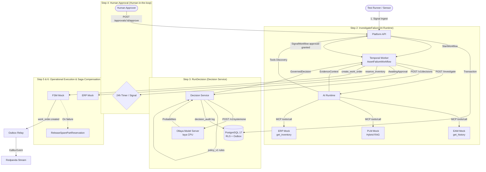

# Acceptance Test Execution Report: Scenario 1 (Pump P-104 Failure)

This document walks step by step through the end-to-end acceptance test — from the overheating signal of centrifugal pump **P-104** at **Acme**'s Manchester plant through to the opening of the FSM work order — documenting all payloads and database states.

---

## 1. Architectural Flow Diagram



---

## 2. Step 0: Prerequisites & Initial State (Database Baseline)

Records already present in the database, prepared by the `optimus-db-seed` Job before the test starts:

```sql
-- PostgreSQL Verification (SET LOCAL app.current_tenant = 'acme')
SELECT id, name, status FROM assets WHERE id = 'P-104';
```
| id | name | status |
|---|---|---|
| `P-104` | Centrifugal Cooling Pump P-104 | `OPERATIONAL` |

```sql
SELECT document_id, section, content, spare_part FROM document_chunks WHERE document_id = 'PLM-COOL-4021';
```
| document_id | section | content | spare_part |
|---|---|---|---|
| `PLM-COOL-4021` | §4.2 | Recurrent overheating in pump cooling manifolds indicates thermostat failure (part SP-COOL-9981)... | `SP-COOL-9981` |

---

## 3. Step 1: Operational Signal Ingestion (Signal Ingestion)

* **Caller:** Test Harness (or IoT Sensor Gateway)
* **Target Service:** Platform API
* **Protocol / Endpoint:** `POST http://platform.optimus.svc:8080/v1/tenants/acme/signals`
* **W3C Header:** `traceparent: 00-4bf92f3577b34da6a3ce929d0e0e4736-00f067aa0ba902b7-01`
* **Tenant Header:** `X-Tenant-ID: acme`

### Request Payload:
```json
{
  "asset_id": "P-104",
  "symptom": "repeated overheating anomaly detected on cooling manifold"
}
```

### Response (HTTP 202 Accepted):
```json
{
  "signal_id": "sig-1727349120000",
  "workflow_id": "wf-asset-failure-P-104-1727349120000",
  "status": "INGESTED"
}
```

### Database Change (PostgreSQL Transaction):
The Platform API writes both the signal and the outbox record in a single database transaction:
```sql
-- 1. A row is inserted into the signals table
INSERT INTO signals (id, tenant_id, asset_id, symptom, status, workflow_id)
VALUES ('sig-1727349120000', 'acme', 'P-104', 'repeated overheating anomaly...', 'INGESTED', 'wf-asset-failure-P-104-1727349120000');

-- 2. An event is added to the Transactional Outbox (dual-write is prevented)
INSERT INTO outbox (tenant_id, event_type, correlation_id, traceparent, payload)
VALUES (
  'acme',
  'signal.received',
  'wf-asset-failure-P-104-1727349120000',
  '00-4bf92f3577b34da6a3ce929d0e0e4736-00f067aa0ba902b7-01',
  '{"signal_id":"sig-1727349120000","asset_id":"P-104","tenant_id":"acme"}'
);
```

### Temporal Startup:
The Platform API starts `AssetFailureWorkflow` via the Temporal Client:
- `WorkflowID`: `wf-asset-failure-P-104-1727349120000`
- `TaskQueue`: `optimus-task-queue`

---

## 4. Step 2: Temporal Activity 1 — `InvestigateFailure` (AI Investigation)

* **Caller:** Temporal Worker
* **Target Service:** AI Runtime (Python / FastAPI)
* **Endpoint:** `POST http://ai-runtime.optimus.svc:8000/investigate`
* **Process Boundaries:** `StartToCloseTimeout: 90s`, `MaximumAttempts: 2`

### Request Payload (Temporal -> AI Runtime):
```json
{
  "tenant_id": "acme",
  "asset_id": "P-104",
  "symptom": "repeated overheating"
}
```

### Sub-steps Performed Inside the AI Runtime:

1. **Dynamic Tool Discovery (Platform API):**
   * `GET http://platform.optimus.svc:8080/v1/tenants/acme/tools`
   * The AI Runtime dynamically fetches the MCP tools permitted for tenant `acme` (`eam.*`, `plm.*`, `erp.*`).
2. **EAM Investigation (MCP JSON-RPC):**
   * Call: `POST http://integration-mocks.optimus.svc:8080` (method: `tools/call`, tool: `eam.get_maintenance_history`)
   * Returned Data:
     ```json
     {
       "asset_id": "P-104",
       "failures_last_30_days": 4,
       "events": [
         {"date": "2026-08-30", "event": "overheating", "resolved": true},
         {"date": "2026-09-06", "event": "overheating", "resolved": true},
         {"date": "2026-09-14", "event": "overheating", "resolved": true},
         {"date": "2026-09-22", "event": "overheating", "resolved": false}
       ]
     }
     ```
3. **PLM Hybrid RAG Search (pgvector + FTS):**
   * Call: `tools/call` (`plm.search_documents`, query: `"P-104 overheating cooling failure"`)
   * Returned Vector Match:
     ```json
     {
       "document_id": "PLM-COOL-4021",
       "section": "§4.2",
       "score": 0.94,
       "content": "Recurrent overheating in pump cooling manifolds typically indicates thermostat failure (part SP-COOL-9981)...",
       "spare_part": "SP-COOL-9981"
     }
     ```
4. **ERP Stock Check (MCP):**
   * Call: `tools/call` (`erp.get_inventory`, part_id: `"SP-COOL-9981"`)
   * Returned Data:
     ```json
     {
       "part_id": "SP-COOL-9981",
       "in_stock": 6,
       "warehouse": "Manchester Warehouse A"
     }
     ```
5. **LLM Synthesis (Dual Provider - Mock / Ollama / Claude):**
   * The LLM synthesizes the evidence: *"4 failure records and the manual match confirm a thermostat failure. 6 units are in stock."*

### Activity 1 Response Payload (`EvidenceContext`):
```json
{
  "asset_id": "P-104",
  "tenant_id": "acme",
  "failures_last_30_days": 4,
  "plm_findings": "Known cooling failure identified in manual PLM-COOL-4021 §4.2: Recurrent overheating indicates thermostat failure (part SP-COOL-9981)",
  "spare_part_id": "SP-COOL-9981",
  "spare_part_in_stock": true,
  "recommendation": "Evidence indicates recurrent thermostat failure under high load. Maintenance manual §4.2 recommends immediate thermostat replacement (SP-COOL-9981).",
  "tool_calls": [
    "eam.get_maintenance_history",
    "plm.search_documents",
    "erp.get_inventory"
  ]
}
```

---

## 5. Step 3: Temporal Activity 2 — `RunDecision` (Typed Decision & Policy)

* **Caller:** Temporal Worker
* **Target Service:** Decision Service (Go)
* **Endpoint:** `POST http://decision-service.optimus.svc:8082/v1/decisions`

### Request Payload:
```json
{
  "tenant_id": "acme",
  "asset_id": "P-104",
  "state": {
    "failures_last_30_days": 4,
    "plm_findings": "Known cooling failure mode in PLM-COOL-4021 §4.2",
    "spare_part_in_stock": true
  }
}
```

### Two-Stage Execution Inside the Decision Service:

1. **Stage 1 — Ollaya SystemOne Model Inference:**
   * The Decision Service issues a call to `POST http://ollaya.optimus.svc:11435/v1/systemone`.
   * The model computes probabilities in a single pass (CPU forward pass, <20ms):
     ```json
     {
       "model": "laya",
       "answers": {
         "severity": {"value": "High", "score": 2.1},
         "safety_risk": {"value": "HIGH", "probability": 0.94},
         "field_visit_required": {"value": true, "probability": 0.91}
       },
       "confidence": 0.94,
       "timing_ms": 18.5
     }
     ```
2. **Stage 2 — Deterministic Policy Engine (`policy_v1`):**
   * The model is not allowed to produce free-form text; the Go rule engine takes over:
     * Rule 1: `score >= 2.0` -> `Severity = "P1"`
     * Rule 2: `safety_risk == "HIGH"` -> **`RequiresApproval = true`**
     * Rule Rationale: *"HIGH safety risk detected: human approval mandated by policy_v1"*

### Database Change (`decision_audit` table):
The decision input, output, and applied policy version are recorded in the audit table:
```sql
INSERT INTO decision_audit (tenant_id, decision_id, asset_id, model, state_payload, raw_response, governed_decision, policy_version, requires_approval)
VALUES (
  'acme',
  'dec-P-104-99881',
  'P-104',
  'laya',
  '{"failures_last_30_days":4,...}',
  '{"confidence":0.94,...}',
  '{"severity":"P1","safety_risk":"HIGH","requires_approval":true}',
  'policy_v1',
  true
);
```

### Activity 2 Response Payload (`GovernedDecision`):
```json
{
  "decision_id": "dec-P-104-99881",
  "severity": "P1",
  "safety_risk": "HIGH",
  "field_visit_required": true,
  "confidence": 0.94,
  "requires_approval": true,
  "approval_reason": "HIGH safety risk detected: human approval mandated by policy_v1",
  "policy_version": "policy_v1"
}
```

---

## 6. Step 4: Waiting for Human Approval (Temporal Signal & Durable Timer)

* **State:** Since `decision.RequiresApproval == true`, the `AssetFailureWorkflow` halts execution.
* **Temporal State:** `workflow.GetSignalChannel("approval-granted")` starts listening and sets up `workflow.NewTimer(24 * time.Hour)`.
* **Resource Consumption:** Zero threads/goroutines are blocked; the Temporal state sleeps in the database.

### Approval Trigger (Test Runner / Field Supervisor):
* **Endpoint:** `POST http://platform.optimus.svc:8080/v1/tenants/acme/approvals/wf-asset-failure-P-104-1727349120000/approve`
* **Response (HTTP 200 OK):**
  ```json
  {
    "status": "approved",
    "workflow_id": "wf-asset-failure-P-104-1727349120000",
    "signaled": true
  }
  ```
* **Temporal Operation:** The Platform API delivers the signal `client.SignalWorkflow(..., "approval-granted", ApprovalSignal{Approved: true, Approver: "j.smith"})`. The workflow wakes up and moves to the operational execution stage.

---

## 7. Step 5: Temporal Activity 3 — `ReserveSparePart` (ERP Reservation)

* **Caller:** Temporal Worker
* **Target Service:** ERP Mock (via MCP)
* **Operation:** The thermostat part is reserved in ERP (`idempotency_key = workflow_run_id`).
* **MCP Call:** `erp.reserve_inventory(part_id: "SP-COOL-9981", qty: 1)`

### Response Payload:
```json
{
  "reservation_id": "RES-SP-COOL-9981-wf-run",
  "part_id": "SP-COOL-9981",
  "quantity": 1,
  "status": "RESERVED"
}
```

---

## 8. Step 6: Temporal Activity 4 — `CreateFieldWorkOrder` & Distributed Compensation (Saga)

* **Caller:** Temporal Worker
* **Target Service:** FSM Mock (Field Service Management)
* **MCP Call:** `fsm.create_work_order(asset_id: "P-104", priority: "P1")`

### Case A: Success Scenario (Happy Path)
FSM confirms the work order and returns a response:
```json
{
  "work_order_id": "WO-P-104-10423",
  "asset_id": "P-104",
  "priority": "P1",
  "status": "ASSIGNED",
  "assigned_tech": "Field Specialist - Manchester Team"
}
```

### Database and Outbox Update:
```sql
-- Written to the Work Order table
INSERT INTO work_orders (id, tenant_id, asset_id, priority, status, idempotency_key)
VALUES ('WO-P-104-10423', 'acme', 'P-104', 'P1', 'ASSIGNED', 'wf-asset-failure-P-104-1727349120000');

-- The final completion event is written to the Outbox
INSERT INTO outbox (tenant_id, event_type, correlation_id, traceparent, payload)
VALUES (
  'acme',
  'work_order.created',
  'wf-asset-failure-P-104-1727349120000',
  '00-4bf92f3577b34da6a3ce929d0e0e4736-00f067aa0ba902b7-01',
  '{"work_order_id":"WO-P-104-10423","asset_id":"P-104","reservation_id":"RES-SP-COOL-9981-wf-run"}'
);
```

### Case B: Failure Scenario & Saga Compensation (Compensating Transaction)
If the FSM service returns a permanent error (e.g. the technician pool crashes):
1. Temporal catches the `CreateFieldWorkOrder` error.
2. It automatically triggers the compensation activity:
   `ReleaseSparePartReservation(tenant_id: "acme", reservation_id: "RES-SP-COOL-9981-wf-run")`
3. The ERP mock is called and the part is released back into stock (`status: "RELEASED"`).
4. The `work_order.failed_compensated` event is written to the Outbox.
5. Workflow result: `status: "FAILED_COMPENSATED", compensated: true`.

---

## 9. Step 7: Final Verification (Acceptance Assertions)

At the end of the run, the acceptance test (`e2e/scenarios/asset-failure/asset_failure_test.go`) performs the following strict assertions:

```go
// 1. Verify the decision is typed and calibrated (never a free-form text substring check)
Expect(decData["severity"]).To(Equal("P1"))
Expect(decData["safety_risk"]).To(Equal("HIGH"))
Expect(decData["field_visit_required"]).To(BeTrue())
Expect(decData["requires_approval"]).To(BeTrue())
Expect(decData["confidence"]).To(BeNumerically(">=", 0.90))
Expect(decData["policy_version"]).To(Equal("policy_v1"))

// 2. Verify the mock services called exactly the expected MCP tools
callLogs, _ := client.GetMockCallLog()
Expect(callLogs).To(ContainElements(
    HaveKeyWithValue("tool", "eam.get_maintenance_history"),
    HaveKeyWithValue("tool", "plm.search_documents"),
    HaveKeyWithValue("tool", "erp.get_inventory"),
    HaveKeyWithValue("tool", "fsm.create_work_order"),
))

// 3. Verify the W3C Trace ID is preserved end to end
Expect(outboxRecord.Traceparent).To(Equal("00-4bf92f3577b34da6a3ce929d0e0e4736-00f067aa0ba902b7-01"))
```
